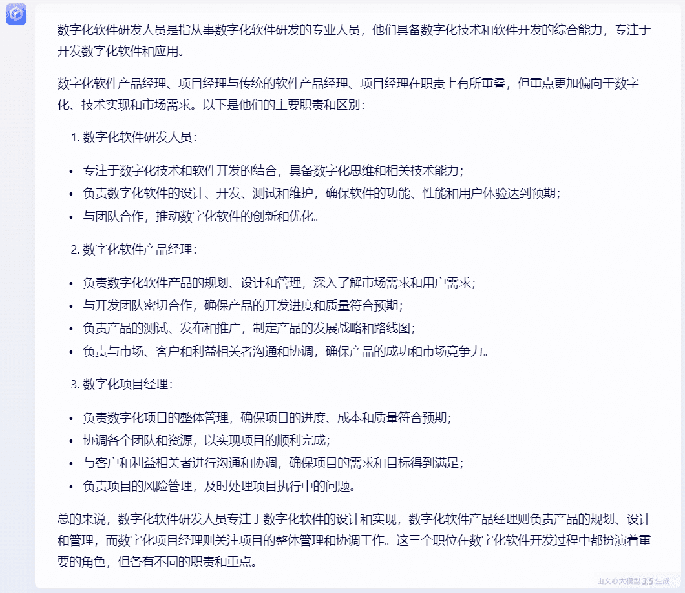
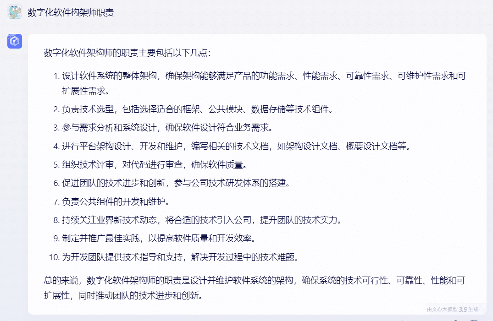
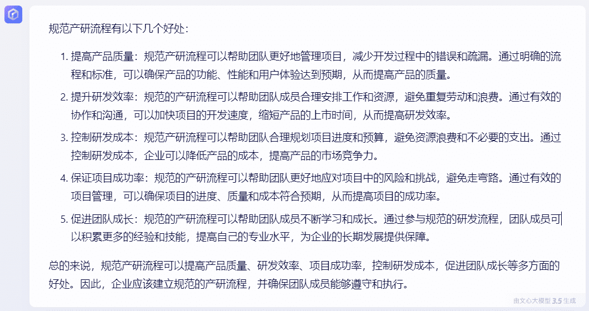
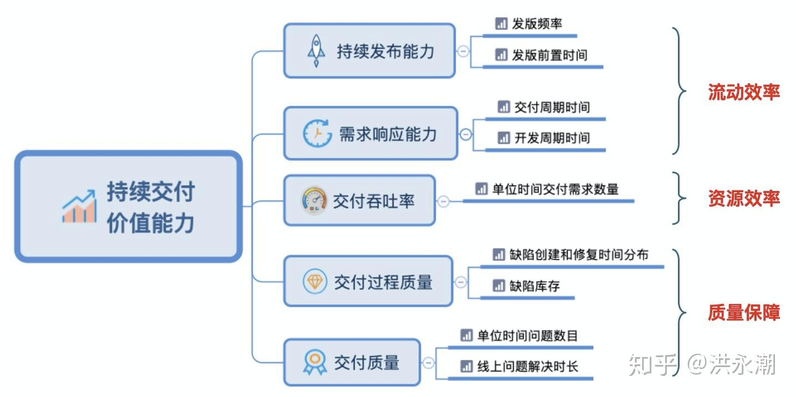

# 前端架构实践

## 数字化研发职责

**数字化研发/研发架构师/产品经理/项目经理是什么？**

> 什么是数字化软件研发人员？数字化软件研发人员和数字化软件产品经理，数字化项目经理有什么区别？他们的职责分别是什么？

**文言一心**

**ChatGPT 3.5**

**总结**

> 数字化研发工程师职责

1. 软件设计、开发、测试、维护；
2. 推动项目计划进度、协调沟通；
3. 确保软件功能稳定、性能极致、提升用户体验；
4. 系统维护，提供技术支持；
5. 推动数字化创新；

> 数字化软件架构师

1. 需求分析把控、技术选型、技术文档、技术评审；
2. 参与公司技术研发体系的搭建、公共组件的开发和维护
3. 提升团队的技术实力、制定并推广最佳实践

> 数字化产品/项目

1. 需求调研、需求分析、原型设计；
2. 产品规划、确定功能和特性；
3. 制定项里程碑、推动项目计划进度、项目风险管理、协调沟通；

**目的：明确研发核心职责，把握研发方向；**

## 产研流程

### 为什么要规范产研流程？

**文言一心**

---

个人理解：

**规范流程，岗位专业化，提高产研效率**

产品/项目：专注数字化业务，提升业务理解，提升需求把握的准确度，提高项目交付效率（业务主导，专注于业务流程）；

研发：提升研发效率，提高交付效率，保障项目交付，保证产品质量（技术主导，专注于交付效率和质量）；

## 如何衡量产研人效

### 研发价值和目标

目标： 提升持续交付的价值能力

## 为什么要前端架构？

### 前端架构解决什么问题？

前端架构是为了解决前端开发中的复杂性和可维护性问题。

随着Web应用的复杂度逐渐增加，前端代码也变得越来越庞大和复杂，如果没有一个好的架构，会导致代码难以维护、扩展和重用。

需要前端架构的原因：

1. **提高可维护性**
   * 前端架构可以将代码组织成模块化和可复用的组件，使得代码更加易于理解和维护。
   * 通过合理的架构，降低组件之间的耦合度，提高代码的灵活性和可扩展性。
2. **提高开发效率**
   * 帮助开发人员更好地组织和利用代码，提高开发效率。
   * 通过使用成熟的框架和工具，可以快速搭建前端应用，减少重复造轮子的情况。
3. **提高用户体验**
   * 前端架构可以帮助开发人员更好地控制页面的性能、样式和行为，提高用户体验。
   * 通过前端架构，可以更好地实现页面优化、性能优化和响应式设计，提高页面的加载速度和响应速度。
4. **促进团队协作**
   * 前端架构可以帮助团队更好地协作和分工，提高开发效率和质量。
   * 通过明确组件的职责和接口规范，可以使得团队成员更好地协同工作，减少沟通和协调的成本。

5. **降低成本**

   * 前端架构可以帮助降低开发和维护的成本。

   * 通过复用成熟的框架和组件，可以减少开发人员的学习成本和使用成本，同时也可以减少后期的维护成本。

### 业务发展

### 个人发展

#### 各大厂不同阶段前端能力标准

## 大厂前端架构分析

### 美团前端架构分析

### 阿里前端架构分析

## 数字化架构分析

### 研发流程痛点分析

#### 发版不一致问题

#### 版本管理不规范

#### 版本回退

* 当前没有任何自动化版本回滚，都是通过 git 手动回滚版本；

#### 接口不规范

#### 服务端开发进度阻塞前端开发进度

#### 重复造轮子

* SRDPM 登录接口开发一次，PMP 登录接口开发一次；
* SRDPM 用户接口开发一次，PMP 用户接口开发一次；
* SRDPM 权限脚本开发一次，PMP 权限 脚本开发一次；
* SRDPM 自动发版构建脚本开发一次，PMP 自动发版构建脚本开发一次；
* 脚手架不统一：SRDPM 搭建一个基本项目脚手架，PMP 也重新搭建一个基本项目脚手架；
* 组件库不统一：SRDPM 开发一个公共组件库，PMP 也开发一个公共组件库；

当出现多个项目时，如：RDM 重构，数据中台系统，权限管理系统重构，配置中台（配置中心，API 中间件中心，队列管理中心），以上重复工作量为量级增加；

当然，通过粘贴复制基础脚手架也能解决以上问题，然而，如果出现组件库版本更新时候，脚手架配置更新时候，是否所有项目也通过粘贴复制模式将更新代码手动更新？如果更新的量大，该如何解决更新量级问题？

#### 服务与业务耦合

* 单点登录服务与 SRDPM 用户数据耦合；

## 适应数字化的前端架构？

## 研发如何反推业务发展？

## 前端架构实践

## 自定义脚手架

### 为什么要自定义脚手架

### 自定义脚本

* 统一规范
* 统一通用后台管理系统模板
* 统一自动部署脚本
* 统一自定义组件包
* 统一权限管理脚本
* 统一自定义模板生成器
* 统一Mock 数据

## 权限系统

## 自动部署

## 版本回滚

### 现状

当前版本回滚没有任何流程化管理模式，使用最原始的分支管理和 git 命令直接回滚

当前回滚版本流程：

以 SRDPM 为例，目前生产服对应 prod 分支代码，测试服对应 test 分支代码，（master 为保护分支，定期将 prod 代码合并到 master）假如生产服某个版本出现重大问题，需要回滚，通过以下 Git 操作流程回滚：

1. 使用 ` git checkout prod` 切换到 prod 分支，使用 `git log` 查看提交记录；
2. 查找到需要回滚的提交记录 hash 值，复制提交记录 hash 值；
3. 使用命令 `git reset --hard <commit-hash>` 强制回滚，也可以使用 `git revert <commit-hash>` 去除提交记录（两个命令区别可以参考文章：[git 回滚](https://sewar-x.github.io/git/#git-%E5%9B%9E%E6%BB%9A)）；
4. 强制推送到远程分支：`git push --force origin <branch-name>`;
5. 执行命令`npm run build`重新构建并上传当前分支代码；

手动回滚的方式缺点非常明显：

* 学习成本高：对于不熟悉 git 命令的开发人员，需要熟悉 Git 各个命令作用和回滚流程；
* 容易出错：首先要熟悉 git 命令和分支管理流程，此外要准确使用 git reset 命令，否则将可能出现不可估量的错误；
* 操作繁琐：每次回滚，都要本地执行以上多个步骤；

为了避免以上问题，为了能够快速回滚代码，需要将回滚流程自动化；

### Node版本回归

### Jenkins 流水线

## 前端埋点系统

前端埋点系统的好处：

- 记录每个页面的访问量（日周月年的UV、PV）；    
- 记录每个功能的使用量；    
- 捕捉报错情况；    
- 图表化显示，方便给其他部门展示；

## 监控和报警系统

