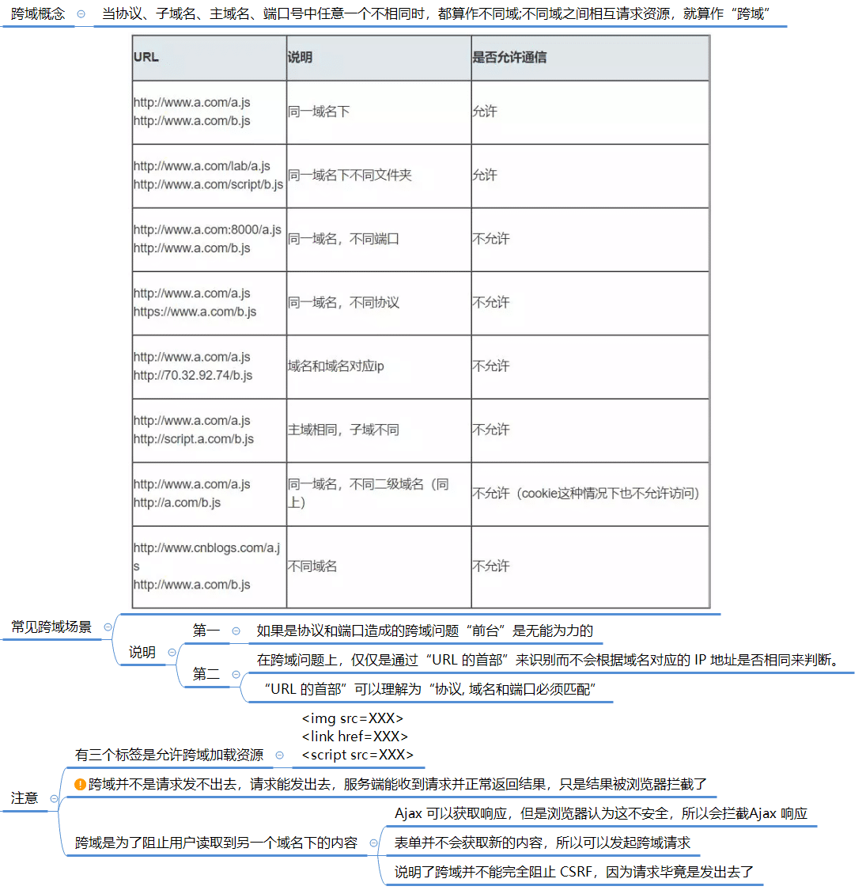
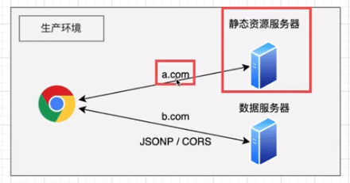
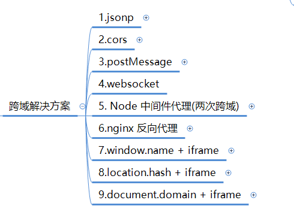
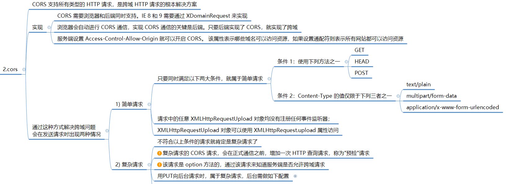
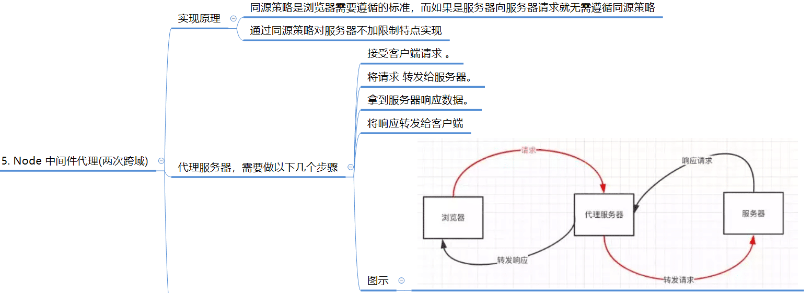
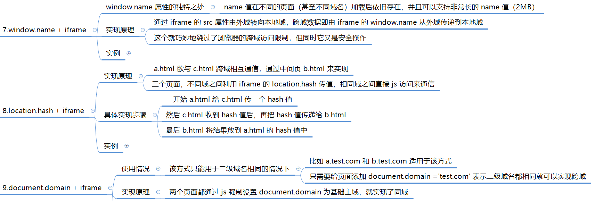
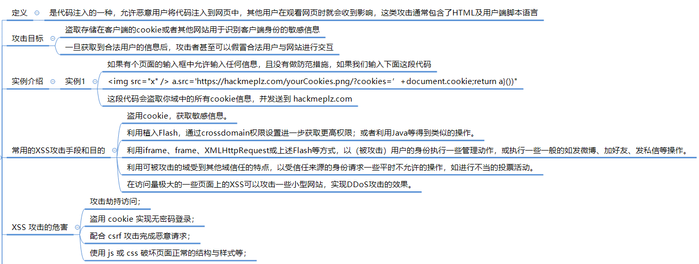
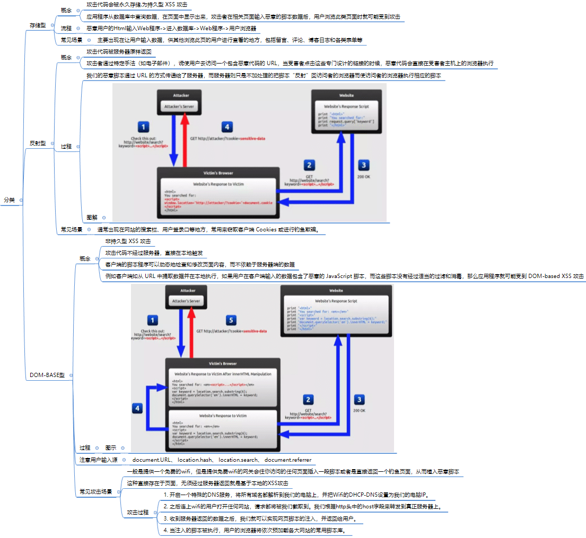
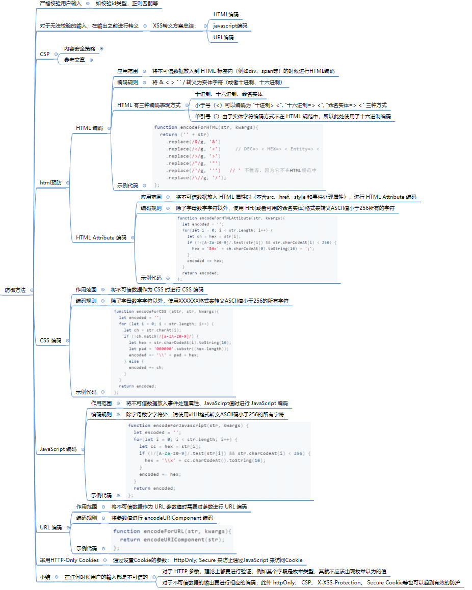

# WEB 安全

## 总览


## 同源策略


同源策略主要表现在以下三个方面：DOM、Web 数据和网络。

- **DOM 访问限制**：同源策略限制了网页脚本（如 JavaScript）访问其他源的 DOM。这意味着通过脚本无法直接访问跨源页面的 DOM 元素、属性或方法。这是为了防止恶意网站从其他网站窃取敏感信息。
- **Web 数据限制**：同源策略也限制了从其他源加载的 Web 数据（例如 XMLHttpRequest 或 Fetch API）。在同源策略下，XMLHttpRequest 或 Fetch 请求只能发送到与当前网页具有相同源的目标。这有助于防止跨站点请求伪造（CSRF）等攻击。
- **网络通信限制：同源策略还限制了跨源的网络通信**。浏览器会阻止从一个源发出的请求获取来自其他源的响应。这样做是为了确保只有受信任的源能够与服务器进行通信，以避免恶意行为。

出于安全原因，浏览器限制从脚本内发起的跨源 HTTP 请求，XMLHttpRequest 和 Fetch API，只能从加载应用程序的同一个域请求 HTTP 资源，除非使用 CORS 头文件

## 跨域



### 判断是否跨域

在前端开发中，可以使用以下几种方法来判断是否存在跨域请求：

1. **浏览器控制台显示跨域错误信息：** 当浏览器发起跨域请求时，如果服务器没有设置正确的跨域相关响应头，浏览器会在控制台中显示跨域错误信息，例如 "Access to XMLHttpRequest at 'URL' from origin 'Origin' has been blocked by CORS policy"。这是最直观且常见的跨域错误提示。

   

2. **网络请求的响应头信息：** 在浏览器的开发者工具中，可以查看网络请求的响应头信息。如果响应头中包含 "Access-Control-Allow-Origin" 字段，并且其值不包含当前页面的域名，则表示存在跨域。

3. **浏览器地址栏的协议、域名、端口不一致：** 当前页面的协议、域名、端口与请求的目标地址不一致时，会触发跨域请求。

   > 
   >
   > 例如：前端打包后的静态资源文件部署在 `a.com` 的静态资源服务器，页面请求的是 `b.com` 的接口数据！

4. **JavaScript中的Error对象：** 如果通过JavaScript代码发起了跨域请求并得到响应，可以判断响应中的Error对象的相关属性，如status属性。如果请求返回的状态码为0或者大于等于400，很可能是跨域请求被阻止。

需要注意的是，以上方法只适用于前端浏览器环境下的跨域判断。在后端服务器环境中，可以通过查看请求的来源头（Referer）来判断是否跨域。

### 跨域解决方案



#### JSONP


#### CORS

> 跨源资源共享（Cross-Origin Resource Sharing，CORS）是一种机制，允许在受控的条件下，不同源的网页能够请求和共享资源。由于浏览器的同源策略限制了跨域请求，CORS 提供了一种方式来解决在 Web 应用中进行跨域数据交换的问题。


**CORS 的基本思想**

1. 服务器在响应中提供一个标头（HTTP 头），指示哪些源被允许访问资源。
2. 浏览器在发起跨域请求时会先发送一个预检请求（OPTIONS 请求）到服务器，服务器通过设置适当的 CORS 标头来指定是否允许跨域请求，并指定允许的请求源、方法、标头等信息。



#####  **在使用 CORS 的 POST 请求时候，浏览器会发送两次请求！**

> 根据CORS规范，进行跨域POST请求时，浏览器会先发送一个预检请求（Preflight Request）来检查服务器是否支持跨域请求!

#####  **预检请求**

预检请求是一种OPTIONS方法的请求，其中包含了一些额外的请求头信息，例如`Access-Control-Request-Method`和`Access-Control-Request-Headers`等。服务器收到预检请求后，会检查这些请求头信息，并返回相应的CORS响应头。

如果服务器返回的CORS响应头中包含了对跨域POST请求的允许，浏览器会继续发送正式的POST请求。这个正式的POST请求与普通的同域POST请求一样，将请求数据发送给服务器，并等待服务器返回响应。

这样的设计是为了确保服务器允许跨域请求，并防止跨域请求对服务器的未经授权的访问。

预检请求的目的是为了确认服务器是否支持跨域请求，并获取服务器返回的CORS响应头信息，以决定是否继续发送正式的POST请求。

预检请求是在实际POST请求之前发送的，因此会增加一定的网络开销和请求延迟。不过，预检请求的缓存时间较长，浏览器会将预检请求的结果缓存起来，以减少后续相同跨域请求的预检开销。


##### **POST 发送两次请求的情况**

1. **重定向：** 当服务器返回一个重定向响应（如HTTP状态码为301或302），浏览器会自动跳转到新的URL。如果原始请求是POST请求，浏览器会在重定向之前先发送一个GET请求，然后才发送POST请求，这样就导致了两次请求。
2. **表单重复提交：** 当用户提交一个表单时，如果用户在提交后刷新了页面，浏览器会提示用户是否要重新提交表单数据。如果用户确认重新提交，浏览器会再次发送POST请求，这样就会导致两次请求。
3. **前端框架或库的影响：** 在使用某些前端框架或库时，可能会导致POST请求发送两次。这可能是由于框架或库的内部机制，或者是由于开发者错误地配置了事件处理程序或表单提交行为。
4. **浏览器的预加载机制 OPTIONS：** 一些现代浏览器具有预加载机制，会在用户可能要点击的链接上提前加载资源，以提高网页加载速度。如果用户在一个页面中点击了一个链接，而该链接指向的页面中包含一个POST表单，浏览器可能会预加载该页面，并发送一个POST请求，这样就导致了两次请求。

需要注意的是，POST请求发送两次并不是POST方法本身的特性，而是由于上述原因导致的。

为了避免这种情况，开发者可以在设计应用程序时注意处理重定向、避免表单重复提交，检查前端框架或库的配置和使用方式，以及了解浏览器的预加载机制。

因此，POST 请求发送两次的情况有多种，不一定就是 CORS 导致！


#####  Node.js 配置 CORS

首先，安装`cors`模块：

```shell
npm install cors
```

然后，在Express应用程序中引入`cors`模块，并使用`app.use()`方法将其作为中间件添加到应用程序中：

```js
const express = require('express');
const cors = require('cors');

const app = express();

// 允许所有跨域请求
app.use(cors());

// 或者根据需求配置具体的跨域选项
// app.use(cors({
//   origin: 'http://example.com', // 允许的请求源
//   methods: 'GET,POST', // 允许的请求方法
//   allowedHeaders: 'Content-Type,Authorization', // 允许的请求头
//   credentials: true // 是否允许发送身份凭证信息（如cookies）
// }));

// 其他路由和中间件...
```

在上述示例中，`app.use(cors())`将启用一个简单的CORS配置，允许所有的跨域请求。如果你想要更精细地控制跨域请求，可以根据需要配置相关选项，例如指定允许的请求源、请求方法、请求头和是否允许发送身份凭证信息（如cookies）等。

请注意，在实际开发中，根据项目需求和安全性考虑，应该仔细配置CORS选项，限制跨域请求的访问权限。

#### postMessage


#### Node 中间代理





##### **webpack dev server**

>  **为什么本地使用 webpack 进行 dev 开发时，不需要服务器端配置 CORS 的情况下访问到线上接口？**

当你使用Webpack进行本地开发时，通常会配置一个开发服务器（Dev Server）来提供静态文件服务和代理转发功能。这个开发服务器会在本地启动一个HTTP服务器，用于提供你的前端应用程序。相当于使用了 Node 中间代理。

在开发环境下，由于前端应用程序和后端接口服务通常运行在不同的域或端口上，涉及到跨域请求。但是，Webpack的开发服务器（如webpack-dev-server或webpack-dev-middleware）会默认配置一个代理服务器（Proxy Server），用于将你的API请求代理转发到后端接口服务器。

当你在前端代码中发起API请求时，Webpack的代理服务器会拦截这些请求，并将它们转发到指定的后端接口服务器。由于代理服务器和后端接口服务器运行在同一个域或端口上，因此不存在跨域请求，不需要进行CORS配置。

通过这种方式，你可以在本地开发环境中直接访问线上接口，而无需关心跨域问题。开发服务器会自动处理跨域请求的转发，使你能够顺利地进行开发和调试。

需要注意的是，**这种代理转发仅适用于开发环境，并不会影响生产环境**。在生产环境中，你仍然需要在服务器端进行CORS配置，以确保跨域请求的安全和访问控制。

##### Vue 配置 dev server

**Vue2 配置 dev server**

在Vue 2中配置开发服务器（Dev Server），你可以使用`vue-cli-service`提供的一些选项来进行配置：

1. 首先，确保你已经安装了Vue CLI（如果没有安装，可以使用`npm install -g @vue/cli`进行安装）。
2. 在Vue项目的根目录下，创建一个`vue.config.js`文件（如果已经存在，请跳过此步骤）。
3. 在`vue.config.js`文件中，添加以下内容：

```js
module.exports = {
  devServer: {
    proxy: {
      '/api': {
        target: 'http://example.com', // 你的后端接口服务器地址
        changeOrigin: true,
        pathRewrite: {
          '^/api': '' // 如果接口路径有前缀，可以在这里进行替换
        }
      }
    }
  }
}
```

> - `target`字段指定了后端接口服务器的地址，例如`http://example.com`。根据实际情况进行修改。
> - `changeOrigin`字段设置为`true`，表示请求头中的Host字段会被设置为目标URL的主机部分。
> - `pathRewrite`字段用于对接口路径进行重写，比如将`/api`替换为空字符串，这样在前端代码中发送请求时可以省略`/api`前缀。

在上述示例中，我们使用`devServer`选项来配置开发服务器。`proxy`字段用于指定代理转发规则，将以`/api`开头的请求转发到指定的后端接口服务器。

#### Nginx


示例：

> 问题：假设前端打包的静态资源服务部署在 `a.com:8080/xxx` 域名下的 端口 8080 中，服务端接口部署在同域名的不同端口 `a.com:9000/xx` 中，由于端口号不同，因此在 `a.com:8080/xxx` 中请求 `a.com:9000/xx` 出现了跨域。
>
> 解决：通过配置 nginx 将 `a.com:9000/xx`请求转发到 `a.com:8080/api` 下，解决跨域问题
>
> 
>
> 配置Nginx作为反向代理，将前端静态资源和后端接口服务统一在同一个域名下，从而避免跨域请求。
>
> 以下是一个基本的Nginx配置示例：
>
> 1. 安装Nginx并启动Nginx服务。
> 2. 打开Nginx的配置文件（通常位于 `/etc/nginx/nginx.conf` 或 `/etc/nginx/conf.d/default.conf`）。
> 3. 在`http`模块中添加一个新的`server`块，配置前端静态资源的代理：
>
> ```
> http {
>   # 其他配置项...
> 
>   server {
>     listen 8080; # 前端静态资源的端口号
>     server_name a.com; # 前端静态资源的域名
> 
>     location / {
>       root /path/to/your/frontend/dist; # 前端静态资源的路径
>       index index.html;
>       try_files $uri $uri/ /index.html;
>     }
>   }
> 
>   # 其他配置项...
> }
> ```
>
> 在上述配置中，我们定义了一个Nginx服务器块，监听端口8080并使用域名`a.com`。`location /`指令将匹配所有请求，并将其代理到前端静态资源的路径，这里假设前端静态资源已经通过Webpack等工具打包到`/path/to/your/frontend/dist`目录下。
>
> 4. 继续在`http`模块中添加另一个`server`块，配置后端接口服务的代理：
>
> ```
> http {
>   # 其他配置项...
> 
>   server {
>     listen 9000; # 后端接口服务的端口号
>     server_name a.com; # 后端接口服务的域名
> 
>     location /api/xx {
>       proxy_pass http://a.com:9000; # 后端接口服务的地址
>       proxy_set_header Host $host;
>       proxy_set_header X-Real-IP $remote_addr;
>     }
>   }
> 
>   # 其他配置项...
> }
> ```
>
> 在上述配置中，我们定义了另一个Nginx服务器块，监听端口9000并使用域名`a.com`。`location /xx`指令将匹配以`/xx`开头的请求，并将其代理到后端接口服务的地址`http://a.com:9000`。`proxy_set_header`指令用于设置请求头，确保后端接口服务可以正确获取到请求的Host和真实IP地址。


#### **`window.name + iframe`**





* 参考资料：[浏览器同源政策及其规避方法](https://www.ruanyifeng.com/blog/2016/04/same-origin-policy.html)


## XSS(跨站脚本攻击)







## [CSP](https://developer.mozilla.org/zh-CN/docs/Web/HTTP/CSP)(内容安全策略)

* CSP指的是内容安全策略，它的本质是建立一个白名单，告诉浏览器哪些外部资源可以加载和执行。我们只需要配置规则，如何拦截由浏览器自己来实现。
* 通常有两种方式来开启CSP:
  * 一种是设置HTTP首部中的 `Content-Security-Policy`
  * 一种是设置meta标签的方式 `<metahttp-equiv="Content-Security-Policy">`

## CSRF(跨站请求伪造)


## 点击劫持

**概念：**

* 点击劫持是一种视觉欺骗的攻击手段，攻击者将需要攻击的网站通过  `iframe` 嵌套的方式嵌入自己的网页中，并将 `iframe` 设置为透明，在页面中透出一个按钮诱导用户点击。

**如何预防？**

* 在http相应头中设置`X-FRAME-OPTIONS`来防御用`iframe`嵌套的点击劫持攻击。通过不同的值，可以规定页面在特定的一些情况才能作为iframe来使用。

**参考资料：**

[《web安全之--点击劫持攻击与防御技术简介》](https://www.jianshu.com/p/251704d8ff18)

