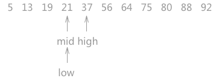

# 查找


## 折半查找

* 适用范围： 有序表

* 思想：

  * 在有序表中，首先选取有序表的中间值 mid
  * 比较中间值 mid 和 目标值 target 大小
    * mid < target: 递归查找左子表
    * mid > target:  递归查找右子表

* 示例

  * 对静态查找表`{5,13,19,21,37,56,64,75,80,88,92}`采用折半查找算法查找关键字为 21 的过程为：
  * 
    [图](http://data.biancheng.net/view/200.html) 1 折半查找的过程（a）
  * 如上图 1 所示，指针 low 和 high 分别指向查找表的第一个关键字和最后一个关键字，指针 mid 指向处于 low 和 high 指针中间位置的关键字。在查找的过程中每次都同 mid 指向的关键字进行比较，由于整个表中的数据是有序的，因此在比较之后就可以知道要查找的关键字的大致位置。
  * 例如在查找关键字 21 时，首先同 56 作比较，由于`21 < 56`，而且这个查找表是按照升序进行排序的，所以可以判定如果静态查找表中有 21 这个关键字，就一定存在于 low 和 mid 指向的区域中间。
  * 因此，再次遍历时需要更新 high 指针和 mid 指针的位置，令 high 指针移动到 mid 指针的左侧一个位置上，同时令 mid 重新指向 low 指针和 high 指针的中间位置。如图 2 所示：
  * 
    图 2 折半查找的过程（b）
  * 同样，用 21 同 mid 指针指向的 19 作比较，`19 < 21`，所以可以判定 21 如果存在，肯定处于 mid 和 high 指向的区域中。所以令 low 指向 mid 右侧一个位置上，同时更新 mid 的位置。
  * 
    * 图 3 折半查找的过程（3）
  * 当第三次做判断时，发现 mid 就是关键字 21 ，查找结束。

* 注意：在做查找的过程中，如果 low 指针和 high 指针的中间位置在计算时位于两个关键字中间，即求得 mid 的位置不是整数，需要统一做取整操作。

* 实现：

  ```javascript
  function BinarySearch(array,target,left, right){
  	let  mid  
  	let  left = 0
  	let  right = array.length - 1
  	while(left  <= right) {
  		mid = (left + right)/2
  		if(array[mid] === array[target]){
  			return array[mid]
  		}else if(array[mid] > array[target]) {
  			right = mid - 1 
          }else {
          	left = mid + 1 
          }
  	}
  	return false
  }
  ```

  

## 二叉排序树（二叉查找树）

## 平衡二叉树（AVL树）

## 哈希查找

## JavaScript 中查找方法

### 数组中查找方法

###### [find()](https://developer.mozilla.org/zh-CN/docs/Web/JavaScript/Reference/Global_Objects/Array/find)

* 实现

  * ```javascript
    Array.prototype.find = function(fn) {
        for (let i = 0; i < this.length; i++) {
            if (fn(this[i])) 
            	return this[i]
        }
    }
    ```

###### [findIndex()](https://developer.mozilla.org/zh-CN/docs/Web/JavaScript/Reference/Global_Objects/Array/findIndex)

* 实现

  * ```javascript
    Array.prototype.find = function(fn) {
        for (let i = 0; i < this.length; i++) {
            if (fn(this[i])) 
            	return i
        }
    }
    ```

###### [indexOf()](https://developer.mozilla.org/zh-CN/docs/Web/JavaScript/Reference/Global_Objects/Array/indexOf)

* 实现

  * ```javascript
    Array.prototype.indexOf = function(value,start) {
    	if(this === null || !value)								// 不允许null调用或则查找值为空
    		return -1
    	let i = 0,length = this.length
    	if(start && typeof start === 'number') {				// 处理第二个参数
    		if(start > length) return -1
    		i = (start < 0 ? Math.max(0,length+start):start);
    	}
        for(;i<length;i++){										//	从第二个参数位置起从前往后查找
           if(this[i]===value){
               return i;
           }
       	}
       	return -1;
    }
    ```

  * 注意

    * `indexOf` 使用[strict equality](https://developer.mozilla.org/zh-CN/docs/Web/JavaScript/Reference/Operators/Comparison_Operators#Using_the_Equality_Operators) (无论是 ===, 还是 triple-equals操作符都基于同样的方法)进行判断 `searchElement与`数组中包含的元素之间的关系
    * 第二个参数 start (开始查找的位置) 规则:
      * 如果该索引值大于或等于数组长度，意味着不会在数组里查找，返回-1。
      * 如果参数中提供的索引值是一个负值，则将其作为数组末尾的一个抵消，即-1表示从最后一个元素开始查找，-2表示从倒数第二个元素开始查找 ，以此类推。
      * 注意：如果参数中提供的索引值是一个负值，并不改变其查找顺序，查找顺序仍然是从前向后查询数组。
      * 如果抵消后的索引值仍小于0，则整个数组都将会被查询。其默认值为0.

###### [lastIndexOf()](https://developer.mozilla.org/zh-CN/docs/Web/JavaScript/Reference/Global_Objects/Array/lastIndexOf)

* 实现

```javascript
    Array.prototype.lastIndexOf = function(value,start) {
    	if(this === null || !value)	
    		return -1
    	let i=this.length-1
    	if(start && typeof start === 'number') {
    		if(start < 0) {
    			if(Math.abs(start) > i) {
    				return -1
    			}else {
    				i = i+start
    			}
    		}else {
    			i = i-start
    		}
    	}
    	for(;i>=0;i--){										//	从第二个参数位置起从后往前查找
           if(this[i]===value){
               return i;
           }
       	}
       	return -1
    }
```

###### [includes()](https://developer.mozilla.org/zh-CN/docs/Web/JavaScript/Reference/Global_Objects/Array/includes)