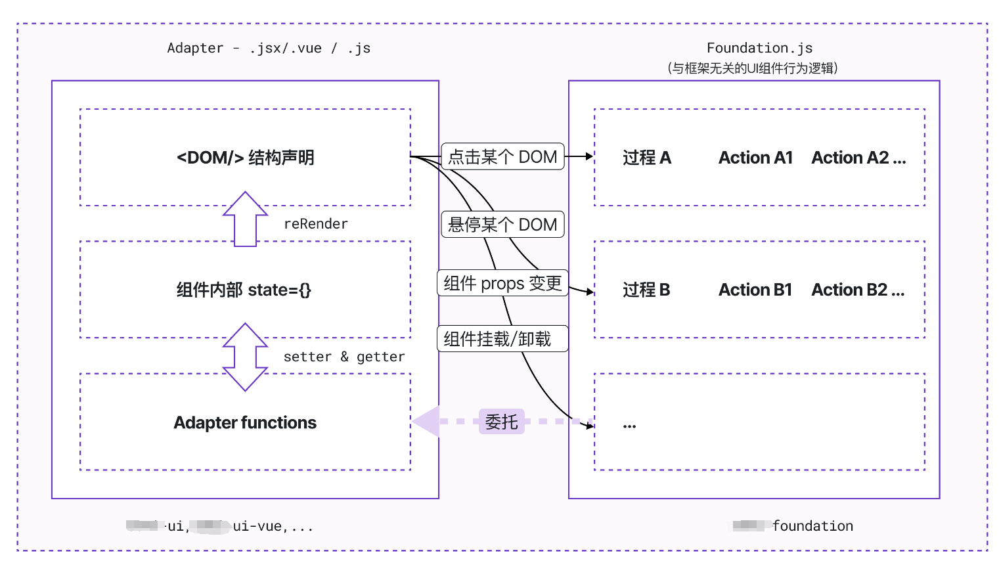
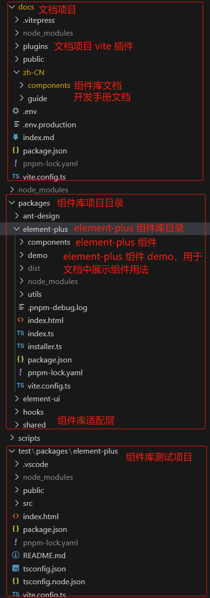

# **从零到一搭建公共组件库**

## **为什么要搭建公共组件库？**

### 公共组件是什么？

看 `ChatGPT` 给出的定义：

> 前端公共组件是指在前端开发过程中，经常会被多个页面或多个项目**复用的组件**。
>
> 这些组件通常具有一定的**独立性和通用性**，可以被封装成独立的模块，供多个页面或项目**共享使用**。
>
> 前端公共组件可以包括但不限于按钮、表单、导航栏、轮播图、模态框、消息提示等常见的UI组件，也可以包括一些业务逻辑相关的组件，如登录组件、购物车组件等。

Vue3 官方文档中对组件定义：[组件基础 | Vue.js (vuejs.org)](https://cn.vuejs.org/guide/essentials/component-basics.html)

> 组件允许我们将 UI 划分为独立的、可重用的部分，并且可以对每个部分进行单独的思考。在实际应用中，组件常常被组织成层层嵌套的树状结构：
>
> 

实际上，在实际前端开发过程中，当接到一个新页面需求时候，一般流程为：

1. 将页面进行组件分析：分析页面中的模块，将页面拆分成一个个组件，分析复用部分，将复用部分封装成组件；
2. 接口拆分：将页面拆成组件后，分析组件格式规范，并将接口拆分到不同组件。
3. 开发组件：罗列所有拆分好的组件，分任务开发；
4. 组合页面：将组件进行拼装组合形成页面。
5. 组件联调：将拆分的组件组成一个页面之后，进行组件之间通信和交互联调；
6. 接口联调测试：最后通过与后端联调测试页面。

### **开源组件库与系统关系**

在封装组件库系统之前，我们先来了解一下，目前开源的各大组件库和系统之前的关系，才能明白为什么要封装自己的组件库。

以 [`Element-Plus` 组件库](https://element-plus.org/zh-CN/component/button.html)为例：

> [`Element-Plus` 组件库](https://element-plus.org/zh-CN/component/button.html)官方文档中，将组件库分为：
>
> **Basic 基础组件**：
>
> * Button 按钮、Border 边框、Color 色彩、Container 布局容器、Icon 图标、Layout 布局、Link 链接、Text 文本、Scrollbar 滚动条、Space 间距、Typography 排版；
>
> **配置组件：**
>
> * Config Provider 全局配置；
>
> **Form 表单组件：**
>
> * Autocomplete 自动补全输入框、Cascader 级联选择器、Checkbox 多选框、Color Picker 取色器、Date Picker 日期选择器、DateTime Picker 日期时间选择器、Form 表单、Input 输入框、Input Number 数字输入框、Radio 单选框、Rate 评分、Select 选择器、Virtualized Select 虚拟化选择器、Slider 滑块、Switch 开关、Time Picker 时间选择器、Time Select 时间选择、Transfer 穿梭框、Upload 上传；
>
> **Data 数据展示：**
>
> * Avatar 头像、Badge 徽章、Calendar 日历、Card 卡片、Carousel 走马灯、Collapse 折叠面板、Descriptions 描述列表、Empty 空状态、Image 图片、Infinite Scroll 无限滚动、Pagination 分页、Progress 进度条、Result 结果、Skeleton 骨架屏、Table 表格、Virtualized Table 虚拟化表格、Tag 标签、Timeline 时间线、Tour 漫游式引导、Tree 树形控件、TreeSelect 树形选择、Virtualized Tree 虚拟化树形控件、Statistic 统计组件（2.2.30）；
>
> **Navigation 导航组件：**
>
> * Affix 固钉、Backtop 回到顶部、Breadcrumb 面包屑、Dropdown 下拉菜单、Menu 菜单、Page Header 页头、Steps 步骤条、Tabs 标签页；
>
> **Feedback 反馈组件**：
>
> * Alert 提示、Dialog 对话框、Drawer 抽屉、Loading 加载、Message 消息提示、Message Box 消息弹出框、Notification 通知、Popconfirm 气泡确认框、Popover 弹出框、Tooltip 文字提示；
>
> **Others 其他组件：**
>
> * Divider 分割线、Watermark 水印；

通过以上分类可以看到：Element-Plus 官方将组件库划分的组件粒度非常细，粒度细到按钮级别；Element-Plus 将组件粒度划分为那么细，个人认为是基于以下原因：

1. **可维护性和可复用性**：Element-Plus作为开源组件库，需要考虑各种应用的需求场景，因此将组件拆分成较小的粒度，每个组件都承担特定的功能，这使得组件更易于理解和维护。同时，小粒度的组件也更易于复用，可以在不同的场景和项目中重复使用，提高了组件的利用率。
2. **性能优化**：小粒度的组件通常意味着更小的体积和更快的加载速度。这有助于提升应用的性能。
3. **设计一致性**：通过将组件拆分成较小的粒度，可以更容易地保持设计的一致性。每个组件都有明确的接口和规范，这使得不同组件之间的交互和配合更加顺畅，有助于提升整体的用户体验。

然而，通常系统中，存在许多相同或相似的组件/模块，特别是在 to B 端项目或中台系统中，大量存在各种各样的From 表单组件、表格组件、搜索组件和弹窗表单组件等。这些组件变化灵活，但又属于一类组件，

以From表单组件为例：B端系统表单内容可以灵活多变，但是外部都是需要套用 element-plus 的 From 表单组件，有统一的提交事件和数据格式等；

> 示例表单A:
>
> 
>
> 示例表单B:
>
> 
>
> 表单A和表单B相同点：
>
> * 都是以弹窗的形式弹出让用户填写表单信息，都需要弹窗组件包裹，因此需要统一的弹窗操作事件：关闭，显示等；
> * 都存在统一的操作：确认和取消；
> * 都存在统一的表单组件和数据格式：都需要使用 From 表单组件包裹和返回统一的数据格式给后端；
>
> 表单A和表单B不相同点：
>
> * 表单项和数量不同；
> * 表单二存在提示组件；

以上两个简单的表单组件，假如使用 Element-Plus 开源标签组件模式开发：

* 第一步：两个组件都在最外层使用一个弹窗组件包裹，并添加对应事件逻辑：
* 第二步：添加From组件逻辑：所有 form 组件都需要组件标签，组件字段和组件事件代码。


* 第三步：添加两个操作按钮；
* 第四步：添加表单内容组件；

通过以上步骤可知：在B端系统中，同样是两个弹窗显示的表单组件，都需要重复以上四个步骤，并且以上四个步骤中第一第二步中都是一模一样的代码逻辑，如果采用单页面开发（一个表单一个页面）模式，重复开发弹窗和表单组件逻辑，随着表单数量增加，此类重复工作量将呈现量级增加！除此之外，项目可维护性也将非常差！一旦产品提出需要在所有弹窗中添加 标题或改动标题位置此类需求，需要找到所有弹窗组件进行修改。


### **为什么要搭建组件库？**

通过以上分析。为了减少开发工作量，提高项目的可维护性，我们需要将一些通用的组件代码封装在一起，减少开发工作量和提高项目的可维护性，并统一所有组件的样式风格。

**提高开发效率**

组件化开发将常用的功能或模块封装成独立的组件，开发者在开发过程中可以直接使用这些组件，而不需要从头开始编写代码。这样可以大大减少重复劳动，提高开发效率。

**降低维护成本**

由于组件是独立的，因此当某个组件出现问题时，只需要对该组件进行维护，而不需要对整个项目进行重新开发和测试。这大大降低了维护成本。

**统一风格和样式**

通过搭建前端组件库，可以制定统一的开发标准，包括组件的命名、接口、样式等，这样可以保证团队成员在开发过程中遵循相同的规范和标准，提高代码的可读性和可维护性。

**提高代码质量**

组件库中的组件都是经过严格测试和验证的，可以确保组件的质量和稳定性。同时，组件化开发也鼓励开发者编写高内聚、低耦合的代码，这有助于提高代码质量。

**促进团队协作**

通过搭建前端组件库，团队成员可以共享组件和资源，减少沟通成本和重复开发。同时，组件库也可以作为团队的技术积累和传承，方便新成员快速融入团队和开发工作。

### **为什么要搭建前端公共组件库？**

目前，通过搭建组件库的方式确实可以节省项目开发时间，然而，目前只是基于当前项目对组件进行二次封装。

> * **每个项目独立维护组件库**：新增一个组件时，需要复制组件副本到其他项目并进行适配。
>
> 
>
> * **公共组件库**：维护统一的组件库，所有系统引用公共组件库。
>
>   

这种模式存在以下问题：

1. **跨项目复用难**：在每个项目都搭建自己的公共组件库的方式，不仅耗费大量时间，并且项目之间的组件库也是相互独立，每次开发一个新系统，都需要搭建系统自己的组件库或者将有组件库系统的系统重新 copy 一份适配新的项目，这种方式极大浪费人力成本。

2. **缺乏文档管理**：除此之外，每个项目中的组件库都缺少文档，这样导致一个问题就是自己封装的组件别人不会用、不知道在哪里用，甚至不知道有这么个东西。
3. **维护成本高**：在每个项目都搭建自己的公共组件库的方式，一旦发现某个公共组件存在 bug，就需要在每个项目都修改对应 Bug，然后所有项目都要重新发版，修改公共组件中的 Bug 效率非常低下。

搭建前端公共组件库的原因主要有以下几点：

**重用性**：

公共组件库允许开发团队在不同项目或同一项目的不同部分中重用组件。这避免了代码的重复编写，提高了开发效率。

**一致性**：

公共组件库确保所有项目都使用相同的组件和接口，从而提高了用户体验的一致性。它还可以帮助维护者更容易地理解代码，因为组件的使用方式和行为在所有项目中都是一致的。

**可维护性**：

当需要更新或修复组件时，只需要在一个地方进行修改，而不需要在整个代码库中查找和替换。这大大减少了维护成本。

**促进团队协作**：

公共组件库可以作为团队的共享资源，帮助新成员更快地理解项目的架构和代码风格。它还可以作为团队内部的知识传递工具，使得团队成员能够共享彼此的经验和最佳实践。

**降低学习曲线**：

对于新加入团队的成员来说，使用公共组件库可以降低学习曲线。他们可以快速了解并使用已经存在的组件，而不需要从头开始学习如何编写每一个细节。

**技术积累和传承**：

公共组件库可以作为技术积累和传承的工具。随着时间的推移，团队可以积累更多的组件和最佳实践，并将其传递给新成员。


## **项目目标**

搭建公司统一组件库，所有前端项目在此贡献并共享组件:

- 将组件库发布到`NPM`官网上，可以通过`npm install` 的方式引入组件库；

- 组件库能按需引入；

- 组件库配套文档；


**最终目标**：

* 沉淀 Vue2、Vue3、React 组件库；
* 打造不同平台上的通用组件库。


## **架构设计**

> 整体架构参考 [Introduction 介绍 - Semi Design](https://semi.design/zh-CN/start/introduction) 设计方案


搭建适配层跨前端框架技术方案，F/A 分层设计，将每个组件的 JavaScript 拆分为两部分：Foundation 和 Adapter，这使得我们可以通过仅重新实现适配器来跨框架重用 Foundation 代码，例如 React、Vue 或者 WebComponent，快速打造不同平台上的通用组件库。。



### Foundation

Foundation 包含最能代表组件交互的业务逻辑，包括 UI 行为触发后的各种计算、分支判断等逻辑，它并不直接操作或者引用 DOM，任意需要 DOM 操作，驱动组件渲染更新的部分会委派给 Adapter 执行。

### Adapter

Adapter 是一个接口，具有 Foundation 实现组件库业务逻辑所需的所有方法，并负责：

1. 组件 DOM 结构声明；
2. 负责所有跟 DOM 操作/更新相关的逻辑，通常会使用框架 API 进行 setState、getState、addEventListener、removeListener 等操作。适配器可以有许多实现，允许与不同框架的互操作性。

## **实施计划**

第一步：搭建兼容 `Vue3` 版本的组件库；

第二步：组件库兼容 `Vue2` 版本；

第三步：组件库兼容 `React` ；

第四步：新增组件库适配层，将不同框架组件库通过适配层编译后形成统一的规范，在任意类型的框架中使用。

该组件库主要适配 PC 端，面向中后台管理系统常见的各种业务场景，主要封装通用组件，如：表单，弹窗等，包括一些特殊组件复用到其他项目中，如：项目进度管理组件等。


## **技术选型**

| 项目         | 技术         | 作用 |
| ------------ | ------------ | ---- |
| Vue3 组件库  | Element-Plus |      |
| Vue2 组件库  | Element-UI   |      |
| React 组件库 | Ant Design   |      |
| 组件文档     | VitePress    |      |
| 站点部署     | Netlify      |      |
| 包管理       | pnpm         |      |
| 仓库管理     | MonoRepo     |      |
| 打包工具     | Vite         |      |


### **仓库管理**

#### **MonoRepo** 

MonoRepo 是一种将多个项目代码存储在一个仓库中的软件开发策略。这种策略的主要优势包括代码复用、简化第三方库管理和原子提交。但是，使用 MonoRepo 也需要注意，因为需要拉取仓库中的全部代码，所以可能需要更多的存储空间。

**创建 MonoRepo 工具**：

一些常用的 MonoRepo 工具包括 Lerna、Changesets 和 Turbo。其中，Lerna 是一个流行的 JavaScript 工具，用于管理具有多个包的 JavaScript 项目，它支持在单个仓库中管理多个 npm 包，并提供了诸如版本控制、依赖管理和发布等功能。

如果你使用 pnpm 这样的新一代包管理工具，可以通过指定工作空间的方式来支持 MonoRepo。


## **搭建流程**

### **pnpm 创建 MonoRepo**

#### **搭建流程**

使用 pnpm Workspaces 创建 MonoRepo 的流程大致如下：

1. **初始化项目**：首先，你需要初始化一个新的 npm 项目。在项目的根目录下运行 `npm init`，并按照提示进行初始化操作。

2. **安装 pnpm**：由于我们要使用 pnpm 进行依赖管理，所以需要在项目中安装 pnpm。可以通过运行 `npm install -g pnpm` 来全局安装 pnpm。

3. **幽灵依赖**：创建 `.npmrc` 文件，并添加以下代码：

   ```shell
   shared-workspace-lockfile = false # 如果启用此选项，pnpm 会在工作空间的根目录中创建一个唯一的 pnpm-lock.yaml 文件, docs: https://pnpm.io/zh/next/npmrc#shared-workspace-lockfile
   shamefully-hoist = true # 解决幽灵依赖问题
   ```

4. **创建 TypeScript 配置**：在项目根目录下创建 `tsconfig.json` 文件，并添加以下代码：

   ```tsx
   {
     "compilerOptions": {
       "target": "esnext",
       "module": "esnext",
       "moduleResolution": "node",
       "strict": true,
       "jsx": "react-jsx",
       "sourceMap": true,
       "resolveJsonModule": true,
       "esModuleInterop": true,
       "lib": ["esnext", "dom"],
       "allowJs": true,
       "baseUrl": ".",
       "paths": {
         "@xw-ui/*": [
           "./packages/*",
           "./*"
         ]
       }
     },
     "include": [
       "packages/*.d.ts",
       "packages/element-plus/components", // element-ui用js开发
       "docs"
     ],
     "exclude": [
       "node_modules"
     ]
   }
   
   ```

5. **创建 packages 目录**：在项目的根目录下创建一个名为 `packages` 的目录，这个目录将用于存放各个子项目。

6. **创建子项目**：在 `packages` 目录下创建各个子项目。每个子项目都应该是一个独立的 npm 包，拥有自己的 `package.json` 文件。你可以手动创建这些子项目，也可以使用一些脚手架工具来快速生成。

   ```js
   - packages
   |--ant-design # React 组件库
   |--element-plus # Vue3 组件库
   |--element-ui # Vue2 组件库
   |--shared
   ```

7. **配置 pnpm-workspace.yaml**：在项目的根目录下创建一个名为 `pnpm-workspace.yaml` 的文件，用于配置 pnpm Workspaces。在这个文件中，你需要指定哪些目录被视为工作空间的一部分。例如，如果你的子项目都位于 `packages` 目录下，你可以这样配置：

   ```shell
   packages:
     - packages/* # 将 packages 目录下所有文件夹项目视为独立项目，能独立安装 node_modules
     - test/packages/* # 将 test/packages/ 目录下所有文件夹项目视为独立项目，能独立安装 node_modules
     - docs
   ```

7. **安装依赖**：运行 `pnpm install` 命令来安装所有子项目的依赖。由于我们已经配置了 pnpm Workspaces，所以这个命令会自动处理子项目之间的依赖关系，并创建符号链接，使得各个子项目可以相互引用。

8. **开发和管理子项目**：进入子项目目录下，初始化 `pnpm`。如进入 `element-plus` 目录下，执行 `pnpm init` ，初始化 node 项目，将生成一个 `package.json` 文件，将该文件的 name 字段改成组件库名称：

   ```json
   {
     "name": "@xw-ui/xw-element-plus", // 将改名字改成组件库名称，后面安装依赖时候需要使用
     "version": "1.0.0",
     "description": "二次封装 element-plus",
     "main": "dist/xw-element-plus.cjs.js",
     "moudle": "dist/xw-element-plus.es.js",
     "scripts": {
       "dev": "vite",
       "build": "vite build",
       "docs:build": "vite build --mode docs"
     },
     "author": "",
     "license": "ISC",
     "peerDependencies": {
       "vue": "^3.2.0",
       "element-plus": "^2.2.0"
     },
     "dependencies": {
       "@element-plus/icons-vue": "^2.0.6",
       "@xw-ui/xw-shared": "workspace:*",
       "@xw-ui/hooks": "workspace:*",
       "lodash": "^4.17.21"
     },
     "devDependencies": {
       "@vitejs/plugin-vue": "^2.3.3",
       "element-plus": "^2.2.8",
       "vue": "^3.2.36",
       "vue-router": "4",
       "less": "^4.1.3"
     }
   }
   
   ```

   同样方式，初始化 `element-ui` 和 `ant-design` 项目。

9. **将组件库连接到全局 `node_modules` 中**：三个包的组件库需要相互调用，因此需要将三个包组件库连接到全局的`node_modules` 中：通过在根目录安装组件包。

   ```shell
   cd ../../ # 回到根目录
   pnpm install @xw-ui/xw-element-plus -w #全局安装你开发的 element-plus 组件包
   pnpm install @xw-ui/xw-element-ui -w #全局安装你开发的 element-ui 组件包
   pnpm install @xw-ui/xw-ant-design -w #全局安装你开发的 ant-design 组件包
   ```

   > **`pnpm install` 命令的 -w 参数**:
   >
   > 在 `pnpm install` 命令中，`-w` 或 `--workspace` 参数是用来指定多工作区安装的。当你有一个 Monorepo（单仓库）项目，其中包含了多个独立的包或项目时，你可以使用 `-w` 参数来同时安装这些包的所有依赖。
   >
   > 具体来说，`-w` 参数会告诉 `pnpm` 去查找 `package.json` 文件中定义的 `workspaces` 字段，并基于该字段中列出的包来安装依赖。这样，你可以确保整个 Monorepo 中的所有包都使用了正确版本的依赖，并且这些依赖只会被安装一次，从而节省了磁盘空间。

#### **项目目录**



### **搭建组件库文档**

#### **技术栈**

| 库           | 作用               |
| ------------ | ------------------ |
| Vitepress    | 搭建静态组件库文档 |
| element-plus | 组件库             |
| less         | css 预处理器       |
| vue^3.2.37   |                    |

#### **搭建流程**

1. **初始化项目**：首先，创建一个新的项目文件夹 docs，并在终端中进入该文件夹。然后，使用`pnpm init`命令初始化项目，并按照提示填写相关信息。
2. **安装Vite**：在项目中安装 Vite 作为构建工具。运行`pnpm add vite --save-dev`命令来安装 `Vite`。
3. **创建Vite配置文件**：在项目的根目录下创建一个名为`vite.config.js`的文件，并添加以下内容：

```javascript
import sideBarPlugin from './plugins/side-bar-plugin'
import sourceCode from './plugins/source-code'
import { defineConfig } from 'vite'
import path from 'path'
import { alias } from '../scripts'

export default defineConfig(async ({ command, mode }) => {
  return {
    server: {
      proxy: {
        '/assets': {
          target: 'http://localhost:8080',
          changeOrigin: true
        }
      }
    },
    plugins: [
      sideBarPlugin(), // 自动生成文档侧边栏插件
      sourceCode()//将 Markdown 文件中的代码示例转换为可显示在网页上的代码片段
    ],
    resolve: {
      alias: [
        ...await alias(), // 统一项目包别名
        {
          find: '@/',
          replacement: path.join(__dirname, '/')
        }
      ]
    }
  }
})

```

4. **创建组件库文档目录结构**：在项目的`docs`目录下创建你的组件库目录结构，创建 `.vitepress` 目录，在该目录下搭建 `vitepress` 文档结构。详细搭建流程参考官方文档：[快速开始 | VitePress](https://vitepress.dev/zh/guide/getting-started)

5. **创建组件文档目录**：在项目的`docs` 目录下创建 `zh-CN` 目录。该目录下分别存放组件库开发手册和组件文档。

   ```js
   
   |-docs
   |-- zh-CN  # 中文文档目录
   |   |-- components  # 组件库文档
   |   |   |-- ant-design 
   |   |   |-- element-plus 
   |   |   |-- element-ui 
   |   |-- guide # 开发手册
   ```

   


### **搭建组件测试项目**

### **部署发布脚本**

### **搭建组件库**

#### **编写组件**

#### **组件测试**

#### **编写组件文档**

#### **发布组件**

### **使用组件**

## **组件列表**

### **组件分类**

#### **基础组件**

#### **扩展组件**

## **参考资料**

[快上车！从零开始搭建一个属于自己的组件库！ - 掘金 (juejin.cn)](https://juejin.cn/post/7120893568553582622)
