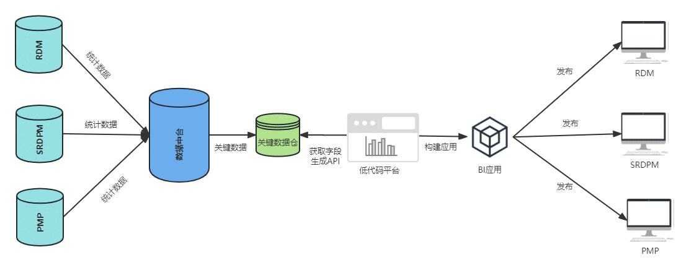
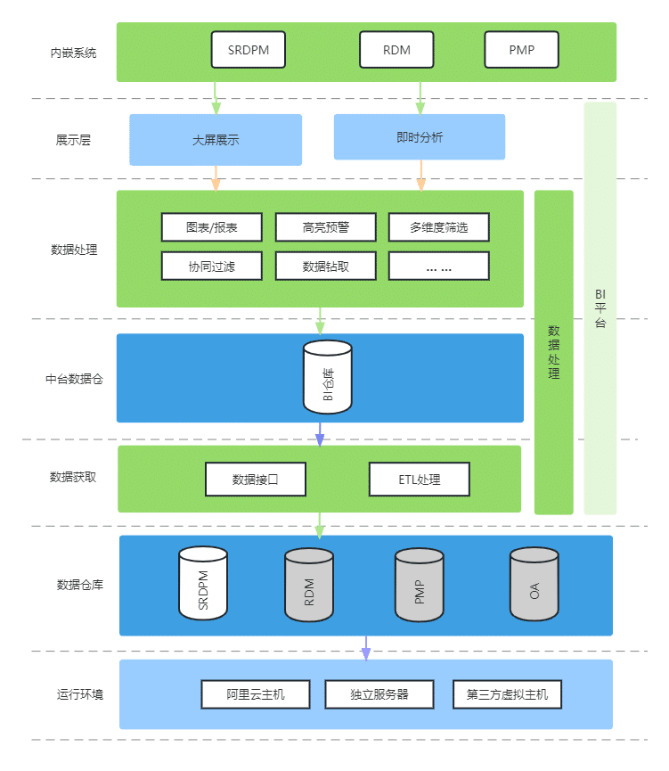
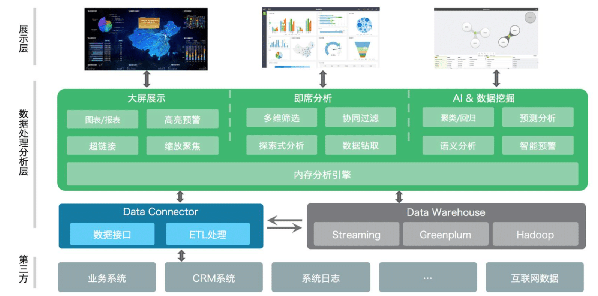
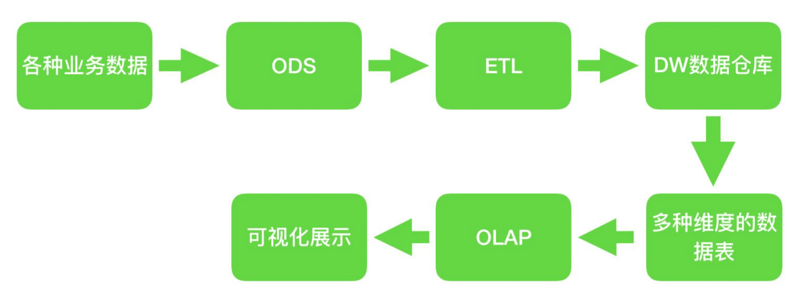
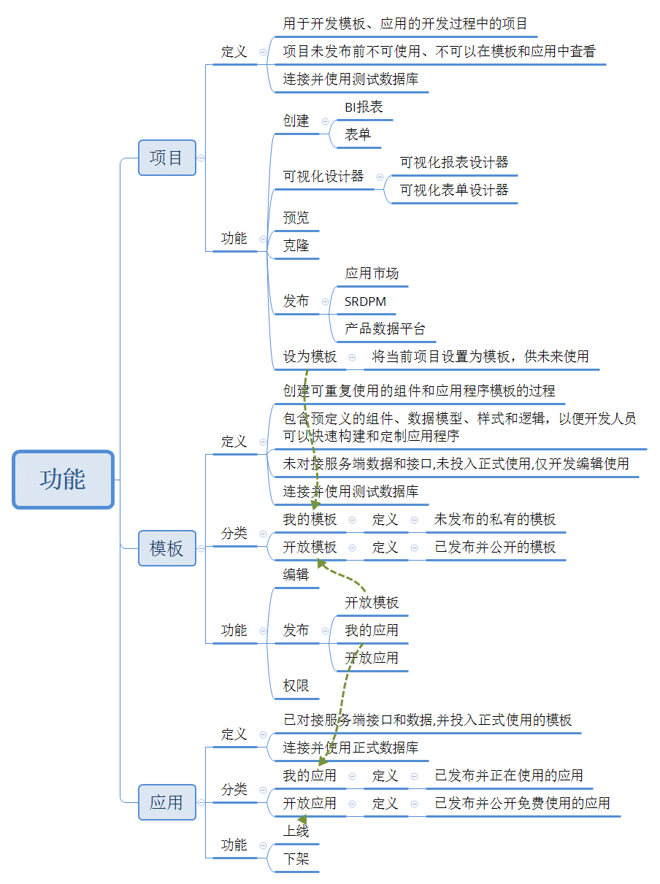
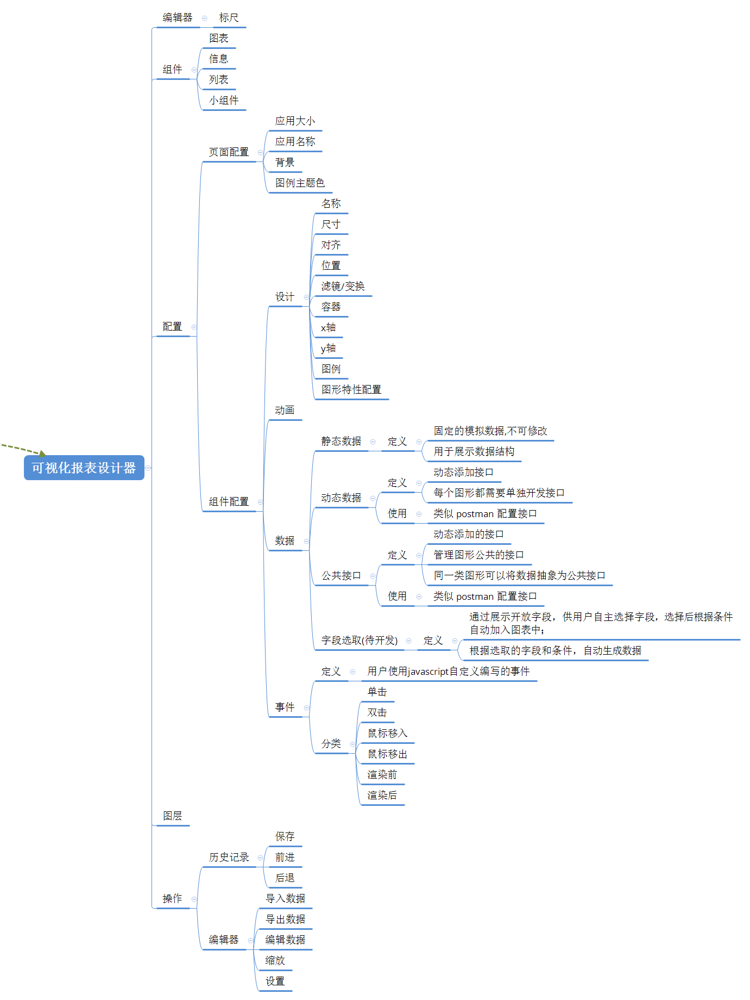

# 搭建低代码平台


## TODO

### 需求
1. 统一所有接口，一个图对应一个接口，一个接口固定一种格式，默认请求地址，不同图只要根据唯一 Key 值区分;
2. 弹窗组件、表格组件、复合图形组件（折线+柱状）
3. 添加平均线配置、是否显示数据配置

## 需求分析

### 背景

* 为了提高数字门槛和软件生产效率，让非专业开发人员也能够快速构建和维护报表，满足数字化转型的需求，并加快企业数字化进程，我们需要解决以下痛点：
  1. 各专业业务人员具备深入的业务逻辑知识，但缺乏软件系统开发技能。
  2. 软件开发人员参与业务需求调研和需求梳理的成本高昂。
  3. 软件开发流程繁琐，周期长。

----


### 目标

* 提供一个零/低代码平台，让非专业开发人员也能够**快速构建和维护报表**；
* 可以自由**结合公司内部现有系统数据**，制作BI报表应用；
* 可以**开放应用**，将应用发布到指定系统，对外使用；


----


### 范围

* 使用人员：**没有编程基础的**非专业开发人员、公司内部业务、信息系统开发员等；


----


## 方案

* 1.建立数据中台数据库；
* 2.建立低代码平台，从数据中台数据库获取数据；
* 3.通过低代码平台拖拽生成 BI 应用；
* 4.通过 BI 平台发布应用到其他平台；




* 
* BI 架构图


* 智能 BI 数据处理的工作原理

----

## 创新贡献

### 技术或产品水平

#### 技术水平

1. 技术领先：平台采用前后端分离架构，前端采用 Vue3 + naive-ui，具有较高的性能和扩展性。
2. 扩展性强：平台在图表组件中可扩展开发，能够满足用户的个性化需求。
3. 代码质量高：平台的代码质量高，可维护性强，易于二次开发和升级。
4. 开发效率高：平台采用低代码开发模式，能够快速构建和部署BI应用。
5. 数据处理能力强：平台具有强大的数据处理能力，能够处理大规模和复杂的数据。

#### 产品水平

1. 用户体验好：平台的用户界面友好、易用，具有较高的用户满意度。
2. 定制化能力强：平台能够满足不同用户的个性化需求，支持灵活的定制化开发。
3. 安全性高：平台具有严格的安全机制和权限控制，确保数据和应用的安全性。
4. 部署和维护简单：平台能够快速部署和维护，降低用户的运维成本和风险。

### 产品综合竞争力/ 商业模式竞争力/效率/成本改善

#### 产品综合竞争力

1. 定制化能力强：自研BI低代码系统可以根据客户的具体需求进行定制化开发，以满足用户的个性化需求。
2. 灵活性高：自研BI低代码系统的架构和功能可根据业务需求进行灵活调整，可以满足特定的业务场景。
3. 成本控制：自研BI低代码系统的开发和维护成本通常较低，可以根据实际需求进行优化和精简，避免冗余和浪费。
4. 数据安全性：自研BI低代码系统容易实现数据的安全性，因为自研系统可以根据具体业务需求进行安全策略的设计和实现。
5. 技术优势：自研BI低代码系统可以根据最新的技术趋势进行更新和升级，从而保持技术上的领先性和创新性。

#### 效率和成本改善

1. 提高开发效率：自研BI低代码平台采用可视化开发方式，开发人员不需要编写复杂的代码，只需要通过拖拽、配置等简单的操作即可完成BI应用的开发，从而提高开发效率。
2. 降低开发成本：自研BI低代码平台可以减少对开发人员的技术要求，不需要招聘专业的BI开发人员，降低开发成本。
3. 缩短上线时间：自研BI低代码平台能够快速构建和部署BI应用，缩短上线时间，提高业务响应速度。
4. 降低运维成本：自研BI低代码平台能够降低运维成本，因为它具有较高的稳定性和可靠性，减少维护和修复的成本。
5. 提高数据分析效率：自研BI低代码平台提供了丰富的数据可视化和分析功能，能够让用户更加直观地理解数据，提高数据分析效率。
6. 优化决策效果：自研BI低代码平台能够实时监控企业的各项数据指标，帮助管理层迅速发现问题和机会，优化决策效果。

### 独创性

----


## 功能

### 功能总览



#### 可视化编辑器



#### 组件配置

#### 组件数据

组件数据展示方式有四种：

* 静态数据
* 动态数据
* 公共接口
* 动态字段（待开发）：通过展示开放字段，供用户自主选择字段，选择后根据条件自动加入图表中；


-----


## 开发实施

### 技术实现

#### 前端技术栈

| 技术       | 技术栈                  | 作用 |
| ---------- | ----------------------- | ---- |
| 语言       | TypeScript              |      |
| UI 框架    | naive-ui                |      |
| JS 框架    | Vue3、Pinia、Vue-Router |      |
| 图表       | Echarts、three.js       |      |
| 拖拽       | vue-draggable.js        |      |
| 代码编辑器 | monaco-editor.js        |      |
| html转图片 | html2canvas             |      |


#### 后端技术栈

| 技术     | 技术栈                 | 作用                                                         |
| -------- | ---------------------- | ------------------------------------------------------------ |
| 开发语言 | Node.js                |                                                              |
|          |                        |                                                              |
| 框架     | express 4.x            |                                                              |
|          |                        |                                                              |
|          | express.static         | 静态文件服务                                                 |
| 中间件   | body-parser            | 解析 HTTP 请求的请求体                                       |
|          | cookie-parse           | 解析 HTTP 请求中的 cookie                                    |
|          | log4js                 | 日志管理模块                                                 |
|          |                        |                                                              |
| 插件     | pathParse.js（自定义） | 获取文件夹路径下所有文件对象挂载到 app 实例对象              |
|          | token.js               |                                                              |
|          |                        |                                                              |
| 数据库   | Sequelize              | Node.js [ORM](https://en.wikipedia.org/wiki/Object-relational_mapping) |


---


#### 元数据管理方案

##### 方案一：DBAPI

###### 工具

[DBAPI](https://www.51dbapi.com/v4.0.0/zh/guide/):DBAPI是一个面向数仓开发人员的低代码工具，只需在页面上编写sql，并配置好参数，就可以自动生成http接口。它可以帮助程序员快速的开发后端数据接口，尤其适用于BI报表、数据可视化大屏的后端接口开发。

###### 方案

* 1.创建数据中台数据库；
* 2.使用 DBAPI 连接数据中台数据库，开放 DBAPI 给用户使用，用户通过 DBAPI 创建接口；
* 3.使用 低代码平台连接 DBAPI 创建的接口；
* 示例图：

###### 缺点

* DBAPI 需要创建人员了解 SQL 语言，提高了门槛；
* DBAPI 只能连接单个数据库，无法连接多个数据库查询，因此需要建立中台数据库；
* DBAPI 查出的数据为未处理的元数据，计算逻辑需要在前端处理；


##### 方案二：提供可选字段

* 在图表中，提供新的界面，界面中选取图表字段（参考 elasticsearch BI 界面）
* 操作：
  * 1.选中图表-数据
  * 2.选择数据-选择表-选择字段
  * 3.选择 x轴/y 轴 —— 选择字段


#### 历史记录


### 接口


### 代码提交规范

* feat: 新功能
* fix: 修复 Bug
* docs: 文档修改
* perf: 性能优化
* revert: 版本回退
* ci: CICD集成相关
* test: 添加测试代码
* refactor: 代码重构
* build: 影响项目构建或依赖修改
* style: 不影响程序逻辑的代码修改
* chore: 不属于以上类型的其他类型(日常事务)


## 服务端

#### 项目基础功能

* 文件上传
* 自动部署

### 安装

```shell
npm install
```

#### 启动

- 默认：

```shell
npm start
```

- 开发环境：

```shell
npm run dev
需要安装：npm i -g nodemon cross-env
```

- 生产环境：

```shell
npm run prod
```

- 生产环境-pm2：

```shell
npm run pm2:prod
```

- 开发环境使用-sqlserver：

```shell
npm run sqlserver
```

#### 使用 PM2 部署

* 安装 PM2
* ` npm install -g pm2 `
* 使用 pm2 的自动部署上传项目
* `pm2 start pm2.json`

## 服务端技术栈

| 技术         | 技术栈                                                       | 作用                                            |
| ------------ | ------------------------------------------------------------ | ----------------------------------------------- |
| 开发语言     | Node.js                                                      |                                                 |
|              |                                                              |                                                 |
| 框架         | express 4.x                                                  |                                                 |
|              |                                                              |                                                 |
|              | express.static                                               | 静态文件服务                                    |
| 中间件       | body-parser                                                  | 解析 HTTP 请求的请求体                          |
|              | cookie-parse                                                 | 解析 HTTP 请求中的 cookie                       |
|              | log4js                                                       | 日志管理模块                                    |
|              |                                                              |                                                 |
| 插件         | pathParse.js（自定义）                                       | 获取文件夹路径下所有文件对象挂载到 app 实例对象 |
|              | token.js                                                     |                                                 |
|              |                                                              |                                                 |
| 数据库       | MySql                                                        |                                                 |
|              |                                                              |                                                 |
| Node.js  ORM | [Sequelize](https://en.wikipedia.org/wiki/Object-relational_mapping) |                                                 |
|              |                                                              |                                                 |
| 进程管理     | [pm2](https://pm2.fenxianglu.cn/docs/start/#google_vignette) |                                                 |
|              |                                                              |                                                 |
| 容器         | docker                                                       |                                                 |


### 项目结构

```
├── README.en.md
├── README.md
├── db
│  └── mysql.sql  针对mysql数据需要的表结构
├── package.json   package文件
├── server.js    服务启动文件
├── src
│  ├── config    配置文件
│  ├── controllers 控制器
│  ├── models    model层
│  ├── routers   路由
│  ├── services   数据库操作
│  └── utils    工具类
└── tmp       文件上传临时目录
  └── upload/tmp
```


### 数据库

#### 数据库脚本参考

* mysql [db/mysql.sql](db/mysql.sql)

* sqlserver [db/sqlserver.sql](db/sqlserver.sql)

#### 业务API配置，在数据库表api中定义

**以下sql为mysql脚本，sql中@line@，为api调用时需要传递的参数，在后端程序会自动根据@line@替换成对应的值。**

- 报表配置-不分页：

```sql
SELECT * FROM bm_ipinfo WHERE plineno = '@line@' AND station='@station@';
```

- 报表配置-分页：

```sql
SELECT COUNT(*) AS total FROM bm_ipinfo WHERE plineno = '@line@' AND station='@station@';
SELECT * FROM bm_ipinfo WHERE plineno = '@line@' AND station='@station@' LIMIT @offset@,@rows@;
```

- 支持跨数据库的配置方式，从而满足一套配置，切换不同数据库的需求：
  具体语法参考：[knex](https://www.knexjs.cn/)

```javascript
knex('pms_plan')
  .select()
  .where({ company_id: '@company_id@', plant_id: '@plant_id@', line: '@line@' })
  .whereBetween('created_at', [moment('@GTD@').format('YYYY-MM-DDTHH:mm:ssZ'), moment('@LTD@').format('YYYY-MM-DDTHH:mm:ssZ')])
  .where(qb => {
    if ('@model@') qb.where('model', '@model@')
    if ('@sn@') qb.where('sn', 'like', `%@sn@%`)
  })
  .orderBy([ { column: 'plan_date' }, { column: 'list_order', order: 'asc' } ])
  .paginate({ perPage: @rows@, currentPage: @page@ })
```

####  业务API测试（vscode，推荐使用Thunder Client工具）

- 调用的url和参数：
  所有api的url的访问都是通过 http:127.0.0.1:4444/api/getDataByApiId进行，通过参数中的apiId进行识别。以下演示了post的参数，get访问也可以只是测试时参数传递不同而已

- 分页的参数传递

```javascript
{
  "restype":"datagrid",
  "apiId": "021ea7a0-d878-11ea-a6ca-35634091a02b",
  "line": "H",
  "station":"6",
  "page":1,
  "rows":10
}
```

- 不分页的参数传递

```javascript
{
  "apiId": "021ea7a0-d878-11ea-a6ca-35634091a02b",
  "line": "H",
  "station":"6"
}
```

- 参数解释：

```javascript
"restype":"前端需要的数据格式，不同的前端所要求的返回格式不同（一般情况：不分页-不需要此字段；分页-datagrid即可）",
"apiId":"数据库api表中id字段，用于标识调用哪个脚本进行返回",
"line、station": "sql语句、存储过程、knex脚本中所需要的变量",
"page":"第几页",
"rows":"页大小"
```

#### sequelize多数据库适配

- 安装对应的package，本项目中只适配了mysql、sqlserver；其他数据库参考下面内容进行适配
- 需要再配置文件[config](src/config/index.js)中增加对应的数据库连接串
- 不同数据库的连接串

```shell
npm install --save pg pg-hstore # Postgres
npm install --save mysql2
npm install --save mariadb
npm install --save sqlite3
npm install --save tedious # Microsoft SQL Server
npm install --save oracledb # Oracle Database
```

- sequelize详细配置文档见：[地址](https://sequelize.org/docs/v6/getting-started/)

* [集成过程中的注意事项](https://www.cnblogs.com/egreen/p/17075035.html)


## CI/CD自动化部署

### 部署方案

1. 使用 docker 构建 node 镜像并部署；
2. 使用  docker 卷挂载文件
3. 使用 webhook 推送分支推送任务：通过 git 推送指定分支代码到 gitee / gogs 仓库后， gitee / gogs  通过 wehook 推送任务到部署程序中，部署服务接受到 gitee / gogs 的 webhook 最新通知后， 执行 bash 脚本，拉取最新代码，并重新启动服务。
4. 使用 pm2 重新启动 node 进程

### 使用 docker 部署 Node 服务


### 总流程

1. 本地同步远程分支
2. 本地构建 docker 镜像
3. 本地打包 docker 镜像
4. 上传 docker 镜像到服务器
5. 解压服务器 docker 镜像

### 部署命令行

```js
// 本地开发环境
 "start": "node cross-env NODE_ENV=development ./src/server.js", 
 // 本地开发环境
  "dev": "cross-env NODE_ENV=development nodemon ./src/server.js",
  //本地链接生产环境
  "prod": "cross-env NODE_ENV=production node ./src/server.js",
  //本地链接测试环境
  "test": "cross-env NODE_ENV=test nodemon ./src/server.js",
  //sql服务
  "sqlserver": "cross-env NODE_ENV=test node ./src/server.js",
  //pm2 测试环境
  "pm2:test": "pm2-runtime start pm2.json --env test",
  //pm2 生产环境
  "pm2:prod": "pm2-runtime start pm2.json --env production",
  // 构建docker测试环境
  "build:test": "cross-env NODE_ENV=test && node ./deploy/index.js build",
  // 构建docker生产环境
  "build:prod": "cross-env NODE_ENV=production && node ./deploy/index.js build",
  //上传docker包到测试服
  "upload:test": "cross-env NODE_ENV=test && node ./deploy/index.js upload",
  //上传docker包到正式服
  "upload:prod": "cross-env NODE_ENV=production && node ./deploy/index.js upload",
  //解压测试服docker包
  "decompress:test": "cross-env NODE_ENV=production && node ./deploy/index.js decompress",
  //解压正式服docker包
  "decompress:prod": "cross-env NODE_ENV=production && node ./deploy/index.js decompress",
  //构建、上传、解压docker测试服包
  "deploy:test": "cross-env NODE_ENV=test && node ./deploy/index.js",
  //构建、上传、解压docker正式包
  "deploy:prod": "cross-env NODE_ENV=production && node ./deploy/index.js"
```

### 部署发布脚本


* 使用命令构建 docker 镜像:

```
docker image build -t low-code-node .
```

* 构建容器：

```
docker container run -d -p 9991:9991 -it low-code-node /bin/bash
```

* 打包镜像

```
docker save  low-code-node > ./package/lowcode.tar
```

* 命令行 docker 构建/上传/解压

```
npm run deploy:prod
```

* 上传 doker 镜像

```
npm run upload:prod
```

注意：使用 docker save  打包后的包默认放入 `/package` 目录下    

### 使用 PM2 运行 node

* 安装 PM2
* ` npm install -g pm2 `
* 使用 pm2 的自动部署上传项目
* `pm2 start pm2.json`


## 使用 docker 部署 

### docker 是什么?

*  **Docker 属于 Linux 容器的一种封装，提供简单易用的容器使用接口**
*  Docker 将应用程序与该程序的依赖，打包在一个文件里面。运行这个文件，就会生成一个虚拟容器。程序在这个虚拟容器里运行，就好像在真实的物理机上运行一样。有了 Docker，就不用担心环境问题。

### 为什么要使用 docker 部署？

* 使用 docker 部署优点
  * **环境一致性**：Docker 可以创建一个独立的容器，其中包含了你的应用程序及其所有依赖项，包括 Node.js 运行时环境、操作系统、库和工具。这确保了在不同的环境中具有一致的运行结果，减少了因环境差异导致的问题。
  * **可移植性**：Docker 容器是可移植的，可以在不同的主机、云服务提供商或开发者之间轻松部署和共享。你可以将容器打包为镜像，并在任何支持 Docker 的环境中运行，无需担心环境配置和依赖项安装。
  * **隔离性**：每个 Docker 容器都是相互隔离的，它们拥有自己的文件系统、网络和进程空间。这意味着你可以在同一主机上运行多个容器，每个容器都可以独立运行和管理，互不干扰。
  * **扩展性**：使用 Docker，你可以根据需要快速扩展应用程序的实例数量。通过简单地创建和启动多个容器副本，可以轻松地实现水平扩展，以应对高流量和负载增加的情况。
* 使用 docker 部署缺点
  *  **资源消耗大**：Docker 需要一定的系统资源来运行容器，包括内存、存储和处理器等。在某些情况下，如果部署的容器数量较多或容器配置不合理，可能会对系统资源造成一定的压力。
  *  **镜像大小**：Docker 镜像的大小可能会比传统的部署方式更大，特别是包含了完整操作系统和依赖项的镜像。这可能会增加镜像的传输时间和存储成本。

### 构建 doker 镜像

#### 一. **使用 Dockerfile 创建 docker 镜像**

> 总流程：
>
> 1. 复制 package.json 并安装依赖；
> 2. 安装 node 镜像和复制安装的依赖；
> 3. 复制项目目录;
> 4. 安装 pm2;
> 5. 挂载卷;
> 6. 对外暴露端口号；
> 7. 运行 pm2;

* 在项目根目录创建 `Dockerfile` 文件，编写容器构建脚本

  ```dockerfile
  # 使用多阶段构建（multi-stage build）的方法，将构建和生产环境分开
  
  # 第一阶段（builder）中，只复制 package.json 和 package-lock.json 并安装生产依赖，以减少构建产物的大小
  # 在第一阶段（builder）中安装生产依赖，以保证构建产物的轻量化
  FROM node:14.17.0 as builder
  WORKDIR /app
  COPY package.json .
  COPY package-lock.json .
  RUN npm install --registry=https://registry.npm.taobao.org --production
   
  # 在第二阶段中，只复制构建产物和运行时所需的依赖,使用更轻量级的 Node 镜像，例如 node:14.17.0-alpine。Alpine 镜像基于 Alpine Linux，体积更小
  # 在第二阶段中只复制已安装的生产依赖，避免复制整个 node_modules 目录
  # 将 COPY . . 命令移动到最后，以减少构建产物的大小。这样，只有必要的文件和目录会被复制到镜像中
  # 将全局安装的依赖（pm2、cross-env、nodemon）移动到第二阶段中，并逐个安装，以确保只安装所需的依赖
  FROM node:14.17.0-alpine
  WORKDIR /app
  ENV NODE_ENV=production
  RUN apk add --no-cache git
  COPY --from=builder /app/node_modules /app/node_modules
  COPY . .
  RUN npm install pm2 -g && npm i cross-env && npm i nodemon
  VOLUME ["/low-code-node-app"]
  EXPOSE 9991
  CMD npm run pm2:prod
  ```

  

* 使用命令构建 docker 镜像:  

  ```dockerfile
  docker image build -t low-code-node .
  ```

  

* 构建容器： 

  ```dockerfile
  docker container run -d -p 9991:9991 -it low-code-node /bin/bash
  ```


#### 二、**使用Docker 卷（Volumes）挂载数据**

* 卷（Volumes）是什么？

  * Docker 卷提供了一种方便的机制来持久化、共享和管理容器中的数据，使数据在容器之间和容器的生命周期之外仍然可用。

* 卷有什么作用？

  * **数据持久化**：Docker 卷可以用于持久化容器中的数据。容器中的文件系统层是临时的，当容器被删除时，文件系统的更改也会丢失。通过将卷挂载到容器中，可以将数据存储到主机上的卷中，使数据在容器重新启动或删除后仍然可访问。
  * **数据共享**：卷可以在多个容器之间共享数据。通过将同一卷挂载到多个容器中，这些容器可以访问相同的数据，实现容器之间的数据共享和通信。
  * **数据备份和恢复**：通过将卷挂载到主机上的特定位置，可以轻松备份和恢复数据。这使得在容器升级、迁移或重新创建时，可以方便地恢复数据。
  * **数据共享与主机解耦**：使用卷可以将容器的数据与特定主机解耦。这意味着可以更轻松地迁移容器和应用程序到其他主机，而不需要担心数据的位置和依赖关系。
  * **数据管理**：Docker 提供了一套命令和工具，可以方便地管理和操作卷，如创建、删除、列出和备份等。

* 使用卷：

  * 使用 `docker volume create` 命令创建卷：(low-code-node 应用程序将其数据存储在 /temp 容器文件系统)

    ```
    docker volume create low-code-node 
    ```

    

  * 启动 low-code-node 应用程序容器，但添加--mount指定卷安装的选项。为卷命名，并将其安装到 /temp 容器中，该容器捕获在该路径中创建的所有文件。

    * 在 Mac 或 Linux 终端中，或者在 Windows 命令提示符或 PowerShell 中，运行以下命令：` docker run -dp 9991:9991 --mount type=volume,src=low-code-node,target=/temp  low-code-node ` ( 该-d标志（ 的缩写--detach）在后台运行容器。该-p标志（ 的缩写--publish）在主机和容器之间创建端口映射。该-p标志采用 格式的字符串值HOST:CONTAINER，其中HOST是主机上的地址，CONTAINER是容器上的端口。该命令将容器的端口 9991 发布到主机上的127.0.0.1:9991( )。localhost:9991 如果没有端口映射，您将无法从主机访问应用程序。)

  * 绑定安装来运行开发容器：
    `docker run -dp 9991:9991 -w /app --mount type=bind,src=$pwd,target=/app low-code-node`

    * -dp 9991:9991 和之前一样。以分离（后台）模式运行并创建端口映射
    * -w /app- 设置“工作目录”或命令将从中运行的当前目录
    * --mount "type=bind,src=$pwd,target=/app"- 将当前目录从主机绑定挂载到/app容器中的目录


#### 三、**使用 Docker Compose  自动构建容器**

* Docker Compose  是什么？

  * Docker Compose 是一个用于定义和管理多容器 Docker 应用程序的工具。它使用一个简单的 YAML 文件来配置应用程序的服务、网络和卷等方面的设置，并提供一组命令来启动、停止和管理这些容器。

* 作用：

  * **简化多容器应用程序的管理**：在复杂的应用程序中，可能需要同时运行多个容器，例如前端应用、后端服务、数据库等。使用 Docker Compose，可以通过一个配置文件定义和管理这些容器，使得整个应用程序的部署和管理变得更加简单。
  * **定义和维护应用程序的环境**：Docker Compose 允许你在配置文件中明确定义应用程序的服务、网络、卷和环境变量等设置。这样可以确保在不同环境中（如开发、测试、生产）具有一致的部署和运行结果，避免了手动配置的错误和差异。
  * **快速启动和停止容器**：使用 Docker Compose，可以通过一个命令一次性启动或停止整个应用程序的所有容器。这对于开发、测试和调试应用程序非常有用，可以节省时间和精力。
  * **容器间的依赖管理**：在多容器应用程序中，容器之间可能存在依赖关系，例如一个容器需要依赖于数据库容器。Docker Compose 允许你定义这些依赖关系，确保容器按正确的顺序启动和连接，简化了容器间的管理和通信。
  * **可扩展性和重用性**：Docker Compose 配置文件是可扩展和可重用的。你可以根据需要添加、修改或删除容器和服务，以适应不同的应用程序需求。此外，你可以将 Docker Compose 配置文件与代码存储在版本控制系统中，方便团队协作和代码复用。

* 使用 docker compose 管理 docker:

  * 创建 `docker-compose.yml` 文件，输入以下内容

    ```yaml
    services:
      low-code-node:
        build: .
        ports:
          - 9991:9991
        volumes:
          - ./:/app
    ```

  * 使用命令自动构建 docker 镜像

    ```
    docker-compose up -d
    ```

    

### 发布脚本

* 发布流程： 构建并打包 docker 镜像 ->  上传 docker 镜像 -> 解压 docker 镜像

* 发布脚本目录：在 `/deploy` 目录下保存所有发布相关脚本

  ```
  ├── deploy
  │  ├── build  构建 docker 脚本
  │  ├── config 文件上传配置
  │  ├── deploy.sh 构建 docker bash 脚本
  │  ├── serverConfig   ftp 文件上传配置
  │  ├── upload  文件上传脚本
  │  └── users   ftp 上传用户信息
  ```

  > 注意:  ftp 上传用户信息 文件不上传到git仓库中，在本地中存储，避免 ftp 用户账号密码泄露

#### 构建打包 docker 

* 在 `/deploy/deploy.sh` 目录中存在构建打包 docker 镜像 bash 脚本：

  > 总流程：
  >
  > 1. 检查 GIT 仓库并初始化；
  > 2. 同步远程仓库代码；
  > 3. 构建 docker ；
  > 4. 打包 docker

  ```bash
  #!/bin/sh
  
  # 检查当前目录是否为 Git 仓库
  if [ ! -d .git ]; then
    echo "当前目录不是 Git 仓库"
    echo "正在初始化 Git 仓库..."
    git init
  fi
  
  # 设置远程仓库和拉取远程分支代码
  remote="mygit"
  branch="low-code-node"
  remote_repository_url="https://gitee.com/jokerxw/low-code-node.git"
  
  
  # 检查远程仓库是否已设置
  if ! git remote | grep -q "$remote"; then
    echo "远程仓库未配置，配置远程仓库..."
    git remote add "$remote" "$remote_repository_url"
  fi
  
  # 拉取远程分支代码
  echo "同步修改..."
  git pull "$remote" "$branch"
  
  echo "docker 构建镜像..."
  nvm use 14.17.5
  docker image build -t low-code-node .
  
  echo "docker 保存镜像..."
  docker save  low-code-node > ./package/lowcode.tar
  
  
  # 检查拉取是否成功
  # if [ $? -eq 0 ]; then
  #   echo "远程仓库同步成功."
  #   pm2 restart low-code-node
  # else
  #   echo "远程仓库同步失败."
  # fi
  ```

#### 上传 docker 镜像

* 使用 `ftp-deploy` 上传 docker 镜像，`ftp-deploy`  为异步上传文件，这里对 异步上传文件使用 `promise` 封装：

  * 上传文件： `/deploy/upload.js`

    ```js
    const FtpDeploy = require("ftp-deploy");
    const ftpDeploy = new FtpDeploy();
    const DeployConfig = require("./config.js");
    
    /**
     * 上传文件
     * @param {*} config 
     * @returns 
     */
    function uploadToFtp(config) {
        return new Promise((resolve, reject) => {
            ftpDeploy.deploy(config, (err) => {
                if (err) {
                    reject(err)
                }
                resolve('上传成功!');
            })
    
        });
    }
    
    /**
     * 上传文件函数
     */
    async function upload() {
        const config = await DeployConfig.getFtpDeployConfig();
        return await uploadToFtp(config)
    }
    
    module.exports = {
        upload
    }
    
    ```

    

  * ftp 文件上传配置： `/deploy/serverConfig.js`

    ```js
    /**
     * ===========================
     *  ftp 文件上传配置
     * ===========================
     */
    // const OUTPUT_DIR = require("../build/constant.ts").OUTPUT_DIR;
    const path = require('path')
    
    //获取上传配置信息
    const getConfig = async function () {
    
      let users = {
        user: null,
        password: null
      }
      try {
        users = require("./users.js");
      } catch (err) {
        console.log('用户信息文件不存在 ', err)
      }
    
      return {
        user: users?.user,
        password: users?.password,
        host: {
          test: " ",
          production: " "
        },
        port: {
          test: 2021,
          production: 2021
        },
        localRoot: path.resolve(__dirname, `../package`),
        remoteRoot: {// 远程静态资源文件路径
          test: ' ',
          production: ' '
        }
      };
    }
    
    
    module.exports = getConfig
    
    ```

  * 文件上传配置: `/deploy/config`

    ```js
    /**
     * ===========================
     * 文件上传配置
     * ===========================
     */
    
    const deployConfig = require("./serverConfig.js");
    
    // 获取执行脚本的 NODE_ENV值
    const getNODE_ENV = function () {
      const script = process.env.npm_lifecycle_script;
      const reg = new RegExp("NODE_ENV=([a-z_\\d]+)");
      const result = reg.exec(script);
      return result[1];
    };
    
    
    module.exports.getFtpDeployConfig = async function getFtpDeployConfig() {
      const config = await deployConfig()
      return {
        user: config.user[getNODE_ENV()], // 服务器登录账号
        password: config.password[getNODE_ENV()], // 服务器密码
        host: config.host[getNODE_ENV()], // 服务器地址
        port: config.port[getNODE_ENV()], // ftp的服务器端口
        localRoot: config.localRoot, // 上传的文件
        remoteRoot: config.remoteRoot[getNODE_ENV()], // 远程服务器文件存储路径
        include: ['*', '**/*'],// 这将上传除了点文件之外的所有文件
        // 排除sourcemaps和node_modules中的所有文件
        exclude: ["dist/**/*.map", "node_modules/**", "node_modules/**/.*", ".git/**"],
        deleteRemote: true, // 如果为true，则在上传前删除目的地的所有现有文件
        forcePasv: true, // 主动模式/被动模式
        sftp: false, // 使用 sftp协议 或 ftp协议
      };
    };
    
    ```

#### 解压 docker 镜像

* 此处解压 docker 镜像中，后端使用 php 调用 bash 执行解压命令，并启动一个解压 docker 服务，因此此处仅调用该服务并监听返回结果即可：此处使用 axios 请求解压 docker 镜像服务

  ```js
  /**
   * 解压 docker 包
   */
  const decompress = async () => {
    try {
      const url = ' '//远程解压 docker 镜像服务地址
      // 使用 axios 发送 GET 请求  
      const response = await axios.get(url);
      if (response.status == 200) {
        return console.log('docker 服务器文件解成功！');
      } else {
        return console.log('docker 服务器文件解失败！');
      }
    } catch (err) {
      console.error(err)
    }
  }
  
  ```

  

#### 总流程

* 发布脚本总流程在 `/deploy/index.js` 中进行发布：

  ```js
  const { build } = require("./build.js");
  const { upload } = require("./upload.js");
  const axios = require('axios');
  
  /**
   * 解压 docker 包
   */
  const decompress = async () => {
    try {
      const url = ''
      // 使用 axios 发送 GET 请求  
      const response = await axios.get(url);
      if (response.status == 200) {
        return console.log('docker 服务器文件解成功！');
      } else {
        return console.log('docker 服务器文件解失败！');
      }
    } catch (err) {
      console.error(err)
    }
  }
  
  /**
   * 发布脚本
   */
  const deploy = async () => {
    try {
      console.log('docker 自动打包中...');
      await build();
      console.log('docker 打包完成！');
      console.log('docker 文件上传中...');
      await upload();
      console.log('docker 文件上传完成！');
      console.log('docker 服务器文件解压中...');
      await decompress()
    } catch (err) {
      console.error(err)
    }
  }
  
  deploy()
  ```

  

### 使用 webhook 推送通知构建

1. 使用 docker 构建 node 镜像并部署；
2. 使用  docker 卷挂载文件
3. 使用 webhook 推送分支推送任务：通过 git 推送指定分支代码到 gitee / gogs 仓库后， gitee / gogs  通过 wehook 推送任务到部署程序中，部署服务接受到 gitee / gogs 的 webhook 最新通知后， 执行 bash 脚本，拉取最新代码，并重新启动服务。
4. 使用 pm2 重新启动 node 进程

#### 部署流程

* 通过以上步骤，构建 docker 镜像；

* 编写 webhook 服务：

  * 监听 webhook 推送任务：在路由中，新增 webhook 推送路由；

    ```js
    'use strict'
    const { webhook } = require('../../../deploy/webhook')
    module.exports = (app, router) => {
        router.post('/api/goview/deploy/wehook', webhook);
        return router
    }
    ```

  * gitee / gogs 仓库中配置 webhook 地址；

  * webhook 任务接受脚本：验证 webhook 推送签名，并执行 bash 脚本

    ```js
    /**
     * webhook  自动部署测试 
     */
    
    const { verify_signature } = require('./gogs-signature.js');
    const path = require('path');
    const spawn = require('cross-spawn');
    const deployScriptPath = path.join(__dirname, 'deploy.sh');
    
    const webhook = async (req, res, next) => {
        try {
    
            if (!verify_signature(req)) {
               
                res.sendError({
                    code: 500,
                    msg: 'webhook 签名错误',
                    data: null
                })
                return false
            }
    
    
            console.log('====自动部署====')
            const deployProcess = spawn(deployScriptPath, [], { shell: true });
            deployProcess.stdout.on('data', (data) => {
                console.log(`stdout: ${data}`);
            });
    
            deployProcess.stderr.on('data', (data) => {
                console.error(`stderr: ${data}`);
            });
    
            deployProcess.on('error', (err) => {
                console.error(`exec error: ${err}`);
            });
    
            deployProcess.on('close', (code) => {
                console.log(`child process exited with code ${code}`);
            });
    
            res.sendResponse({
                msg: '操作成功',
                data: {}
            })
        } catch (error) {
            res.sendError({
                code: 500,
                msg: error,
                data: error
            })
        }
    }
    
    module.exports = {
        webhook
    }
    
    ```

  * bash 脚本： 拉取最新代码，并重新启动 pm2

    ```
    #!/bin/sh
    
    # 检查当前目录是否为 Git 仓库
    if [ ! -d .git ]; then
      echo "当前目录不是 Git 仓库"
      echo "正在初始化 Git 仓库..."
      git init
    fi
    
    # 设置远程仓库和拉取远程分支代码
    remote="origin"
    branch="low-code-node"
    remote_repository_url="http://szmoka.tclking.com:8081/xuwen/low-code-node.git"
    
    
    # 检查远程仓库是否已设置
    if ! git remote | grep -q "$remote"; then
      echo "远程仓库未配置，配置远程仓库..."
      git remote add "$remote" "$remote_repository_url"
    fi
    
    # 拉取远程分支代码
    echo "同步修改..."
    git pull "$remote" "$branch"
    
    # 检查拉取是否成功
    if [ $? -eq 0 ]; then
      echo "远程仓库同步成功."
      pm2 restart low-code-node
    else
      echo "远程仓库同步失败."
    fi
    ```

    

## 参考资料

* [docker 官方文档](https://docs.docker.com/get-docker/)
* [docker 教程(阮一峰)](https://ruanyifeng.com/blog/2018/02/docker-tutorial.html)
* [Docker 从入门到实践](https://www.w3cschool.cn/reqsgr/)
* [pm2](https://pm2.fenxianglu.cn/docs/start/)


