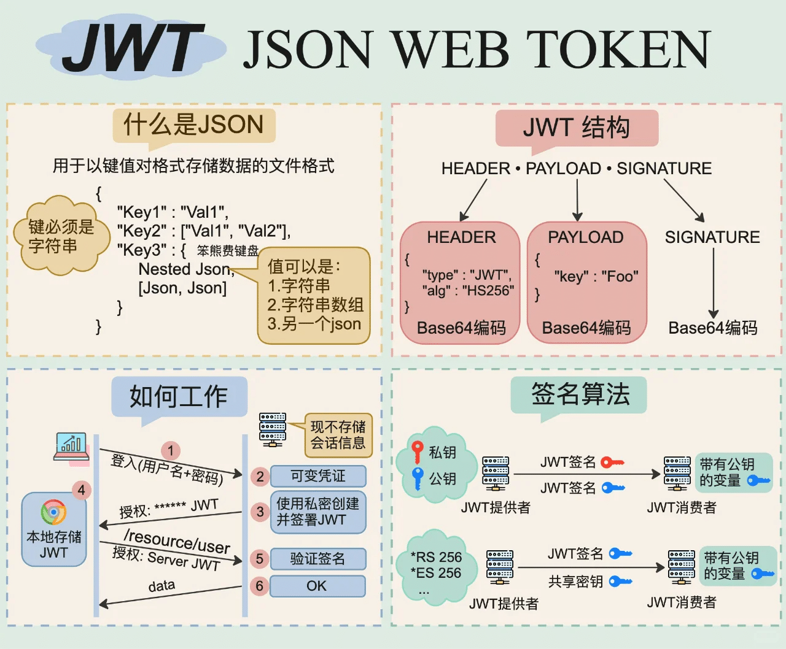
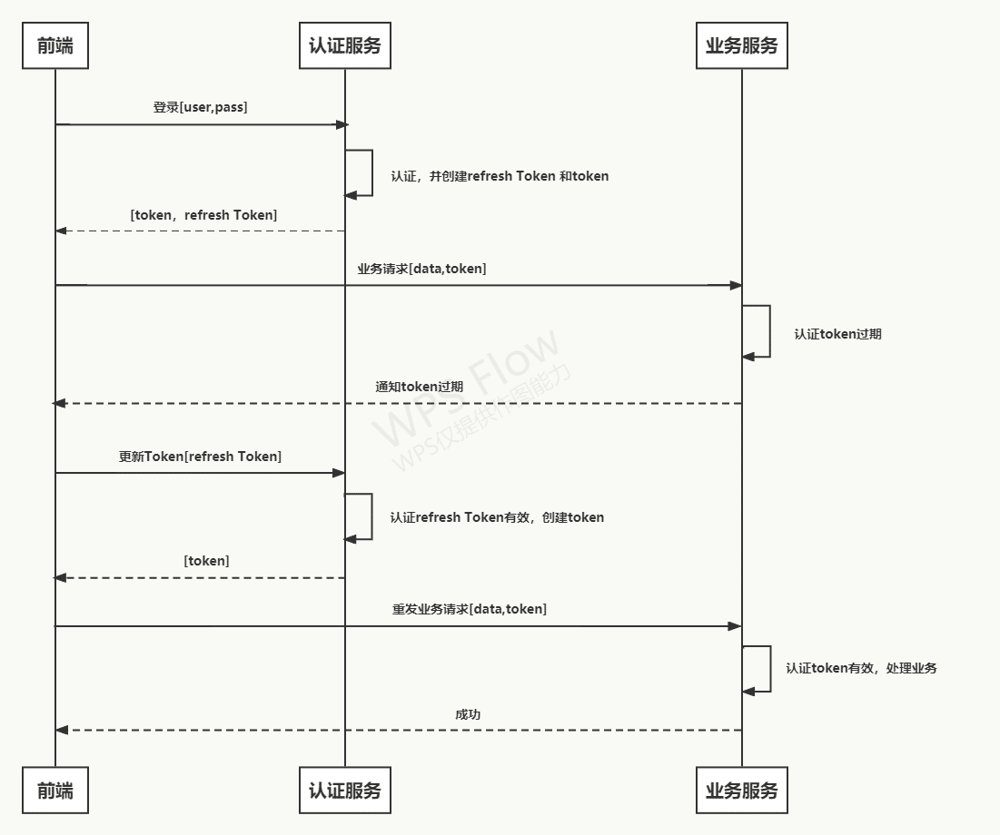
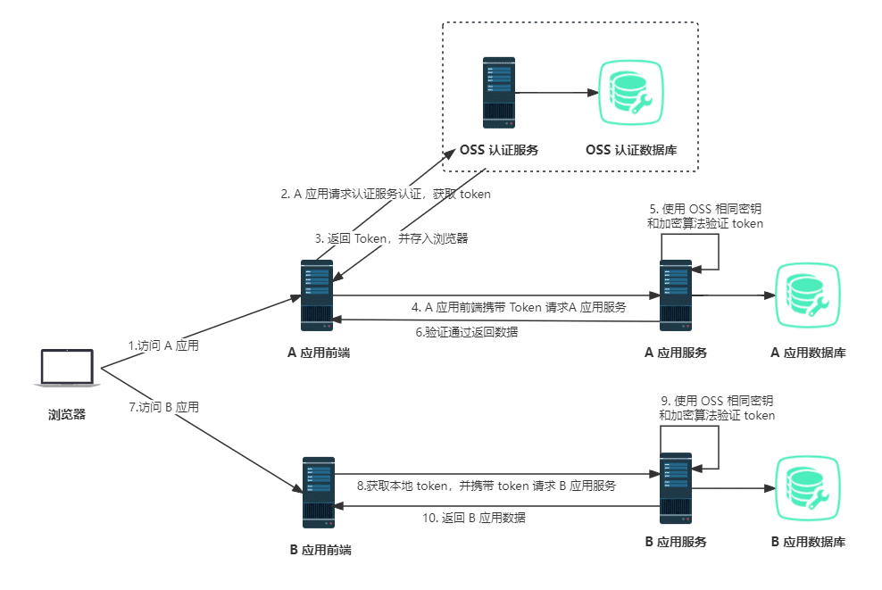

## 登录

## JWT 鉴权机制



### 概念

JWT（JSON Web Token）是一种开放标准（RFC 7519），用于在网络应用间传递信息的一种方式。它是一种基于JSON的轻量级、自包含的安全令牌，用于在客户端和服务器之间进行身份验证和授权。

JWT由三部分组成：头部（Header）、载荷（Payload）和签名（Signature）。

- 头部（Header）：描述JWT的元数据和签名算法。

  - ```js
    {  "alg": "HS256",  "type": "JWT" }
    ```

    > * `alg`: 声明算法类型
    >
    > 因为 JWT 是字符串，还需要对 JWT 进行 base64 编码，最终为一串字符串：
    >
    > `eyJhbGciOiJIUzI1NiIsInR5cCI6IkpXVCJ9`

- 载荷（Payload）：包含要传递的信息，如用户身份、权限等。

  - 载荷即消息体， 这里会存放实际的内容， 也就是 token 的数据声明 ，例如用户的 id 和 name，默认情况下也会携带令牌的签发时间 iat，还可以设置过期时间

    ```js
    {
        "sub": "1234567890",
        "name": "John Doe",
        "iat": 1516239022
    }
    ```

    > 同样会进行 base64 编码，生成字符串：`eyJzdWIiOiIxMjM0NTY3ODkwIiwibmFtZSI6IkpvaG4gRG9lIiwiaWF0IjoxNTE2MjM5MDIyfQ`

- 签名（Signature）：使用密钥对头部和载荷进行签名，用于验证JWT的真实性和完整性。

  - 公式：`Signature = HMACSHA256(base64Url(header)+.+base64Url(payload),secretKey)`
  - 一旦前面两部分数据被篡改，只要服务器加密用的密钥没有泄露，得到的签名肯定和之前的签名不 一致。

### 令牌验证过程

当应用系统使用 JWT 作为令牌格式进行验证时，需要以下参数来验证JWT令牌的有效性：

1. **令牌本身**（Token）： 应用系统需要接收到从前端传递过来的JWT令牌，通常作为HTTP请求头的一部分（例如，Authorization头）或作为请求参数的一部分。
2. **公钥或共享密钥**（Public Key/Shared Key）： 应用系统需要拥有与JWT令牌进行签名验证所需的公钥或共享密钥。这个密钥是在JWT令牌生成的过程中由发行令牌的身份提供者生成的。
3. **签名算法**（Signing Algorithm）： 应用系统需要知道用于JWT令牌签名的算法，以正确验证签名。常见的签名算法包括HMAC（基于共享密钥）和RSA（基于公钥/私钥对）。

因此，不同系统之间需要对同一个  JWT 令牌验证时候，需要获取到 SSO 认证中心的 **公钥或共享密钥** 和 **签名算法**；


当前端携带令牌请求某个应用系统时，该应用系统会将令牌发送到令牌验证服务进行验证。验证服务会执行以下步骤：

1. **解析令牌**：验证服务首先会解析令牌，提取其中的信息，例如用户ID、过期时间等。
2. **验证签名**：验证服务会使用事先共享的密钥或公钥对令牌的签名进行验证，以确保令牌未被篡改。
3. **验证有效期**：验证服务会检查令牌的有效期，以确保令牌未过期。
4. **验证权限**：验证服务可能会进一步检查令牌中包含的用户角色或权限信息，以确保用户具有访问所请求资源的权限。
5. **返回验证结果**：验证服务会向应用系统返回验证结果，指示令牌是否有效。


### JWT 优点

1. **无状态和可扩展性**：由于JWT是自包含的，服务端不需要存储会话信息，使其成为无状态的身份验证解决方案。这使得应用程序具有更好的可扩展性，可以轻松地添加或删除服务器实例。
2. **跨平台和跨语言**：JWT是基于标准的**JSON格式**，可以在不同的平台和编程语言之间进行交互和使用。这使得它成为构建跨平台应用程序和微服务架构的理想选择。
3. **安全性**：**JWT使用签名进行验证，确保令牌的真实性和完整性**。通过使用密钥进行签名，可以防止令牌被伪造或篡改。此外，可以使用加密的JWT来保护敏感信息。
4. **灵活性**：JWT的载荷部分可以包含自定义的信息，可以根据应用程序的需求灵活定义和使用。这使得JWT成为在身份验证和授权之外传递其他相关信息的有效方式。

然而，JWT也有一些缺点：

1. **无法撤销**：一旦JWT被签发，就无法撤销或失效，除非等待其过期时间。因此，在某些情况下，例如用户密码被重置或权限被撤销时，需要采取额外的机制来处理失效的令牌。
2. **增加网络传输负载**：由于JWT包含了自身的信息和签名，因此它的大小相对较大，可能会增加网络传输的负载。这在大量的API请求中可能会产生一定的开销。
3. **不适用于存储敏感信息**：尽管JWT可以进行签名和加密，但不建议在JWT中存储敏感信息，因为JWT的载荷部分是可以被解码的。对于敏感信息的保护，应该使用其他安全机制。


### 为什么使用 JWT？

JWT （JSON Web Token）主要作用是用户身份认证，通过 JWT 可以识别登录的唯一用户，获取用户信息。

JWT适用于许多情况，特别是在以下场景中需要使用JWT：

1. **分布式身份验证**：当应用程序由多个独立的服务组成时，JWT可以作为一种有效的身份验证解决方案。用户在登录成功后，服务器颁发一个JWT给客户端，并在后续的请求中使用该令牌**进行身份验证**，而无需在每个服务中进行数据库查询或共享会话状态。
2. **跨域身份验证**：当应用程序的前端和后端部署在不同的域名下时，由于浏览器的同源策略限制，传统的基于Cookie的身份验证无法直接使用。在这种情况下，可以使用JWT作为身份验证的方式，因为JWT可以在HTTP请求头或URL参数中进行传递。
3. **单点登录（SSO）**：JWT可以用作实现单点登录的一种方式。用户在通过身份验证后，可以使用JWT在多个关联的应用程序之间进行无缝的身份验证和授权。
4. **移动应用程序身份验证**：对于移动应用程序，JWT可以作为一种轻量级和安全的身份验证机制。移动应用程序可以在用户登录后，将JWT保存在本地，并在后续的请求中附加JWT作为身份验证凭证。
5. **微服务架构**：在微服务架构中，各个服务可以使用JWT进行身份验证和授权，而无需依赖中心化的身份验证服务。这样可以简化系统的复杂性并提高可扩展性。


### 使用流程

* 服务端：登录验证，成功后，服务端根据用户信息生成 token;
* 客户端：本地保存 token，每次请求时请求头带上 token 信息；
* 服务端：验证token ： 访问某些资源或者接口时 ， 验证token。


### Node Token 中间件

> token 中间件使用 jsonwebtoken 封装

* JWT 对象：创建、验证 Token:

  ```js
  'use strict'
  
  
  /**
   * ==================================================
   *  token 方法插件封装
   * ==================================================
   */
  
  const jwt = require('jsonwebtoken')
  const { TOKEN, APP } = require('@config')
  const { codeEnums, codeMsgEnums, tokenCodeMsgEnums, tokenCodeEnums } = require('@enums/response.js')
  class JwtToken {
    constructor(expiresIn, secret) {
      this.expiresIn = expiresIn
      this.secret = secret
    }
  
    async createToken(user) {
      if (user) {
        user.password = null
        return await jwt.sign({ role: 'USER', ...user }, this.secret, { expiresIn: this.expiresIn })
      } else {
        return await jwt.sign({ role: 'GUEST', id: null, username: null }, this.secret, { expiresIn: this.expiresIn })
      }
    }
  
    /**
     * 验证 Token
     * @param {*} token
     * @returns
     */
    async verifyToken(token) {
      let res_data = {
        code: tokenCodeEnums.Unauthorized,
        name: tokenCodeMsgEnums[tokenCodeEnums.Unauthorized],
        message: tokenCodeMsgEnums[tokenCodeEnums.Unauthorized],
        data: null
      }
      if (!token) {
        return res_data
      }
  
      if (token.startsWith(TOKEN.tokenStartsWithStr)) {
        // Remove tag from string
        token = token.slice(TOKEN.tokenStartsWithStr.length, token.length)
      }
      try {
        const decoded = await jwt.verify(token, this.secret)
        res_data = {
          code: codeEnums.OK,
          name: codeMsgEnums[codeEnums.OK],
          message: codeMsgEnums[codeEnums.OK],
          data: decoded
        }
      } catch (err) {
        res_data = {
          code: tokenCodeEnums.InvalidToken,
          name: err.name,
          message: err.message,
          data: err
        }
      } finally {
        return res_data
      }
    }
  }
  
  module.exports = (expiresIn, secret) => {
    return new JwtToken(expiresIn || TOKEN.sessionExpiresIn, secret || APP.APP_SECRET)
  }
  
  ```

* token 中间件：请求时候，根据路由名单，验证用户 token:

  ```js
  /**
   * =====================================================
   * 校验客户端请求token中间件,处理检查请求头部token是否正确
   * 文档：https://www.npmjs.com/package/jsonwebtoken
   * 参考资料：https://segmentfault.com/a/1190000015255975
   * =====================================================
   */
  
  const { TOKEN } = require('@config')
  const tokenKit = require('@plugins/token')
  const { codeEnums, tokenCodeMsgEnums, tokenCodeEnums } = require('@enums/response.js')
  
  /**
   * 以下是一些常见的标准的 token 错误码：
   * 401 Unauthorized：没有提供 token 或者提供的 token 无效。
   * 403 Forbidden：提供的 token 是有效的，但用户没有足够的权限访问所请求的资源。
   * 419 Authentication Timeout（或 440 Login Timeout）：token 已过期或超时。\
   * 498 Invalid Token：提供的 token 无效。
   * 499 Token Required：没有提供 token。
   * 500 Internal Server Error：服务器在尝试验证 token 时遇到了内部错误。
   */
  
  /**
   * token 验证中间件
   * @param {*} req
   * @param {*} res
   * @param {*} next
   */
  const tokenAuth = async (req, res, next) => {
    if (!TOKEN.tokenAuthWhiteList.some(v => req.path.indexOf(v) >= 0)) {
      //判断当前访问路径是否存在于白名单,不存在白名单内进行验证
      const token = req.headers.authorization
      if (!token) {
        return res.sendError({
          code: tokenCodeEnums.Unauthorized,
          msg: tokenCodeMsgEnums[tokenCodeEnums.Unauthorized]
        })
      }
  
      try {
        const decoded = await tokenKit().verifyToken(token)
        if (decoded.code === codeEnums.OK) {
          // 将用户信息存储到请求对象中
          req.user = decoded.data
          next()
        } else {
          return res.sendError({
            code: tokenCodeEnums.InvalidToken,
            data: decoded.data
          })
        }
      } catch (e) {
        return res.sendError({
          code: tokenCodeEnums.InvalidToken,
          msg: tokenCodeMsgEnums[tokenCodeEnums.InvalidToken],
          data: e
        })
      }
    } else {
      // 白名单域名
      next()
    }
  }
  module.exports = tokenAuth
  
  ```

* 服务端创建 token: 用户登录成功后，根据用户信息，创建 token 并返回。

  ```js
  const passwordValidator = require('password-validator')
  const tokenKit = require('@plugins/token')
  const { TOKEN } = require('@config')
  const { Users } = db
  const { codeEnums } = require('@enums/response.js')
  
  /**
   * 用户注册
   */
  
  const regsiter = async (req, res, next) => {
    try {
      let { username, password } = req.getReqParams()
      const schema = new passwordValidator()
      const validMsg = {
        min: '长度必须至少为8个字符',
        uppercase: '必须包含至少一个大写字母',
        lowercase: '必须包含至少一个小写字母',
        digits: '必须包含至少一个数字',
        spaces: '不能包含空格'
      }
      schema
        .is()
        .min(8, validMsg.min)
        .has()
        .uppercase(1, validMsg.uppercase)
        .has()
        .lowercase(1, validMsg.lowercase)
        .has()
        .digits(1, validMsg.digits)
        .has()
        .not()
        .spaces(1, validMsg.spaces)
  
      const isValidPassword = schema.validate(password, { list: true })
      if (isValidPassword.length !== 0) {
        const msgs = isValidPassword.map(msg => validMsg[msg])
        return res.sendError({
          code: codeEnums.OK,
          msg: `密码设置错误! 密码 ${msgs.join(';')}`,
          data: null
        })
      }
  
      // 创建新用户记录
      const [user, created] = await Users.findOrCreate({
        where: {
          username
        },
        defaults: {
          password: password
        }
      })
      if (!created) {
        return res.sendError({
          code: codeEnums.OK,
          msg: '该用户已存在！',
          data: null
        })
      } else {
        user.password = null
        user.salt = null
        return res.sendResponse({
          msg: '注册成功!',
          data: user
        })
      }
    } catch (error) {
      res.sendError({
        msg: '系统错误',
        data: error
      })
    }
  }
  
  /**
   * 用户登录
   */
  const login = async (req, res, next) => {
    try {
      let { username, password } = req.getReqParams()
      let user = await Users.findOne({ where: { username: username }, raw: true })
  
      if (!user) {
        return res.sendError({
          msg: `未找到对应的用户 ${username}，请核查！`
        })
      }
      //密码验证
      let ok = await Users.validatePassword(password, user.salt, user.password)
      if (!ok) {
        return res.sendError({
          msg: `用户 ${username} 登录密码密码不正确，请核查！`
        })
      }
      let token = await tokenKit().createToken(user)
      // 设置 cookie
      res.cookie(TOKEN.tokenCookiesKey, token, {
        httpOnly: true,
        secure: false,
        sameSite: 'none'
      })
      let userData = {
        token: {
          tokenName: 'Authorization',
          tokenValue: TOKEN.tokenStartsWithStr + token,
          isLogin: true,
          loginId: user.id,
          loginType: 'login',
          tokenTimeout: TOKEN.tokenExpMinutes,
          sessionTimeout: TOKEN.tokenExpMinutes,
          tokenSessionTimeout: TOKEN.tokenExpMinutes,
          tokenActivityTimeout: TOKEN.tokenExpMinutes,
          loginDevice: null,
          tag: null
        },
        userinfo: {
          id: user.id,
          username: user.username,
          password: null,
          nickname: user.nick,
          department_id: user.department_id,
          depId: null,
          posId: null,
          depName: null,
          posName: null
        }
      }
  
      res.sendResponse({
        msg: '操作成功',
        data: userData
      })
    } catch (error) {
      console.error(error)
      res.sendError({
        code: 500,
        msg: error,
        data: error
      })
    }
  }
  /**
   * 退出登录
   * @param {*} req
   * @param {*} res
   * @param {*} next
   */
  const logout = async (req, res, next) => {
    const token = req.headers.authorization
    if (!token) {
      res.sendError({
        code: codeEnums.Unauthorized,
        msg: '未授权',
        data: null
      })
    }
  
    try {
      // 删除客户端 cookies
      res.clearCookie(TOKEN.tokenCookiesKey)
      res.sendResponse({
        msg: '注销成功',
        data: null
      })
    } catch (error) {
      res.sendError({
        code: codeEnums.BadRequest,
        msg: '注销失败',
        data: error
      })
    }
  }
  
  module.exports = {
    regsiter,
    login,
    logout
  }
  
  ```


### 前端如何保存 Token?

#### 前端保存 Token 流程

* 前端登录，登录成功后，服务端返回 token;
* 前端本地存储 token;
* 在所有请求中，加入 token；

#### 前端实现

**第一步：前端本地存储 token **

> 前端本地存储Token的常见方案包括以下几种：
>
> 1. **LocalStorage**：LocalStorage是HTML5提供的一种本地存储方案，可以将数据以键值对的形式存储在浏览器中。使用LocalStorage存储Token时，可以使用`localStorage.setItem('token', 'your-token')`进行存储，使用`localStorage.getItem('token')`进行获取。LocalStorage中的数据会一直保留，除非主动清除或用户清除浏览器缓存。
> 2. **SessionStorage**：SessionStorage与LocalStorage类似，也是HTML5提供的本地存储方案，但是数据的生命周期仅限于会话期间。当用户关闭浏览器标签页或浏览器时，SessionStorage中的数据会被清除。使用方法与LocalStorage类似，可以使用`sessionStorage.setItem('token', 'your-token')`进行存储，使用`sessionStorage.getItem('token')`进行获取。
> 3. **Cookie**：Cookie是一种在浏览器和服务器之间传递的小型数据片段，可以用于存储Token。使用JavaScript可以通过`document.cookie`来操作Cookie。存储Token时，可以将Token作为Cookie的值进行设置，例如`document.cookie = 'token=your-token'`。在后续的请求中，浏览器会自动将Cookie作为请求头的一部分发送给服务器。
> 4. **IndexedDB**：IndexedDB是浏览器提供的一种高级的客户端存储数据库，可以用于存储大量结构化数据。与LocalStorage和SessionStorage相比，IndexedDB提供更丰富的查询和事务支持。存储Token时，需要使用IndexedDB的API进行操作，例如创建数据库、创建对象存储空间、存储Token数据等。

在前端本地存储 token 一般封装一个公共类或扩展工具函数，在此处使用 `js-cookie` 封装；

* 使用 `js-cookie` 封装 storage 工具函数：

  ```js
  import Cookies from 'js-cookie'
  
  export function SetCookies(key, value, options) {
    if (value !== null && typeof value === 'object') {
      value = JSON.stringify(value)
    }
    Cookies.set(key, value, options)
  }
  
  export function GetCookies(key) {
    const value = Cookies.get(key)
    let result = null
    try {
      result = JSON.parse(value)
    } catch (e) {
      result = value
    }
    return result
  }
  
  export function RemoveCookies(key, options) {
    Cookies.remove(key, options)
  }
  
  ```

* Token 存储封装： 

  ```js
  import { SetCookies, GetCookies, RemoveCookies } from '@/utils/storage.js'
  import { createIframe, destroyIframe } from '@/utils/index.js'
  import Settings from '@/settings/encrypt.js'
  import { OaUrl } from '@/settings/constants.js'
  const { TokenKey, OATokenKeys, OALoginToken } = Settings.TOKEN
  
  
  /**
   * 设置 Token 信息
   * @param {*} param
   */
  export function setTokenInfo({ token, expire, key, ticketName, ticketValue }) {
    SetCookies(TokenKey, token)
    setOAToken(ticketName, ticketValue)
  }
  
  /**
   * 移除 Token 信息
   */
  export function removeAuthToken() {
    removeToken()
    removeOAToken()
  }
  
  /**
   * 获取 Token
   * @param {*} key
   * @returns
   */
  export function getToken(key) {
    return GetCookies(key || TokenKey)
  }
  
  /**
   * 设置 Token
   * @param {*} token
   * @returns
   */
  export function setToken(token) {
    return SetCookies(TokenKey, token)
  }
  
  /**
   * 移除 Token
   * @returns
   */
  export function removeToken() {
    return RemoveCookies(TokenKey)
  }
  
  /**
   * 获取 Token, 由于 OA 使用三个 token，因此需要遍历获取 token
   * @returns
   */
  export function getOAToken() {
    let key = null
    let oaToken = null
  
    for (const keys of OATokenKeys) {
      oaToken = GetCookies(keys, {
        domain: '.tcl.com'
      })
      if (oaToken) {
        key = keys
        break
      }
    }
  
    return {
      key,
      oaToken
    }
  }
  
  /**
   * 设置 OA token
   * @param {*} tokenKey
   * @param {*} token
   * @returns
   */
  export function setOAToken(tokenKey, token) {
    return SetCookies(tokenKey, token, {
      expires: new Date(new Date().getTime() + 1 * 60 * 60 * 1000),
      domain: ''
    })
  }
  
  /**
   * 清空所有 oa token
   */
  export function removeOAToken() {
    OATokenKeys.forEach(key =>
      RemoveCookies(key, {
        domain: ''
      })
    )
  }
  
  /**
   * 获取新 oa token:LtpaToken, 通过创建 iframe,重定向获取 oa 登录 token
   */
  export function getOALoginToken() {
    // 存在 token 或 开发环境下不获取
    const { oaToken } = getOAToken()
    if (
      getToken(OALoginToken) ||
      !oaToken ||
      process.env.NODE_ENV === 'development'
    ) { return }
    const dom = document.body
    const iframe = createIframe({
      dom,
      onload: () =>
        setTimeout(() => {
          destroyIframe(iframe)
        }, 500),
      src: OaUrl,
      hidden: true,
      onerror: destroyIframe(iframe)
    })
  }
  
  ```

**第二步：请求携带 Token**

* 在此处使用 axios 作为请求工具，在 axios 请求拦截器中，请求时候在请求头中添加token：

  ```js
   config.headers['accessToken'] = getToken()
  ```

完整 axios 请求拦截配置代码：

```js
import axios from 'axios'
import { OnlyMessageBox } from '@/plugins/modules/onlyMsgbox.js'
import { MessageBox } from 'element-ui'
import store from '@/store'
import { getToken } from '@/utils/auth'

// create an axios instance
const service = axios.create({
  baseURL: process.env.VUE_APP_BASE_API, // url = base url + request url
  // withCredentials: true, // send cookies when cross-domain requests
  timeout: 60000 // request timeout
})

// request interceptor
service.interceptors.request.use(
  async config => {
    // do something before request is sent

    if (store.getters.token) {
      // let each request carry token
      config.headers['accessToken'] = getToken()
    }
    return config
  },
  error => {
    // do something with request error
    console.log(error) // for debug
    return Promise.reject(error)
  }
)

// response interceptor
service.interceptors.response.use(
  /**
   * If you want to get http information such as headers or status
   * Please return  response => response
  */

  /**
   * Determine the request status by custom code
   * Here is just an example
   * You can also judge the status by HTTP Status Code
   */
  response => {
    const res = response.data
    const code = Number(res.code)
    if (code === 40029) { // 登录过期
      MessageBox.confirm('您的登录时间已过期,请重新登录!', '登录过期', {
        confirmButtonText: '确定',
        type: 'warning',
        callback: action => {
          store.dispatch('user/logout')
          return Promise.reject(new Error(res.msg || 'Error'))
        }
      })
    } else if (code !== 200) {
      OnlyMessageBox.error({
        message: res.msg || 'Error',
        duration: 3 * 1000
      })
      return Promise.reject(new Error(res.msg || 'Error'))
    } else {
      return res
    }
  },
  error => {
    OnlyMessageBox.error({
      message: error || 'Error',
      type: 'error',
      duration: 3 * 1000
    })
    return Promise.reject(error)
  }
)

export default service

```

### **Token 更新**流程



---


## 单点登录

### **概念**

* 单点登录（Single Sign-On，简称SSO）是一种身份验证和授权的机制，允许用户**只需进行一次登录认证，即可在多个相关应用或系统中访问受保护的资源**，而无需为每个应用单独提供凭据。

* 传统的登录方式要求用户在每个应用或系统中输入用户名和密码进行认证，这对于用户来说可能会导致繁琐的登录流程和多个不同的凭据。而SSO的目标是简化用户登录体验，提高用户的便利性和工作效率。


### **为什么要用单点登录?**

单点登录（Single Sign-On，SSO）是一种身份验证和授权机制，允许用户在多个关联的应用程序或网站之间使用单个登录凭据进行登录，而无需在每个应用程序或网站上重新输入凭据。以下是一些使用单点登录的好处：

* **便利性和用户体验**：单点登录简化了用户的登录流程，用户只需登录一次，即可访问多个应用程序或网站，减少了频繁登录的麻烦。这提供了更好的用户体验，并提高了用户的满意度。
* **提高安全性**：通过单点登录，用户的凭据只需要在认证中心进行验证一次，而不需要在每个应用程序或网站上传输和存储凭据。这减少了凭据被截获或泄露的风险，并提高了整体系统的安全性。
* **简化管理**：单点登录简化了身份验证和用户管理的复杂性。管理员只需在认证中心管理用户的凭据和权限，而不需要在每个应用程序或网站上单独管理用户信息。这降低了管理的工作量，并提高了系统的可维护性。
* **统一用户体验**：通过单点登录，用户可以在不同的应用程序或网站之间实现无缝的用户体验。用户的个人信息和偏好设置可以在不同应用程序间共享，使用户感觉它们是一个整体的系统。
* **降低开发成本**：使用单点登录可以减少开发人员在每个应用程序或网站上实现身份验证和授权的工作量。开发人员只需集成认证中心并使用其提供的API进行身份验证，从而减少了重复劳动和开发成本。


### 单点登录实现

在前后端分离的架构中，实现单点登录流程：

1. **认证服务**：首先，你需要有一个专门的认证服务（例如使用 OAuth、OpenID Connect 等），用于处理用户的登录和认证。该认证服务可以是单独的服务，也可以是你的后端服务中的一部分。
2. **生成令牌**：当用户进行登录操作时，认证服务会验证用户的凭证，并生成一个令牌（例如 JSON Web Token，JWT）。该令牌应包含用户的标识信息和其他必要的认证信息。
3. **跨域存储令牌**：在用户成功登录后，认证服务将令牌返回给前端应用。前端应用可以将该令牌存储在 LocalStorage 中。由于 LocalStorage 是浏览器独立于域名的存储机制，因此可以通过 LocalStorage 实现跨域缓存。
4. **发送令牌**：当用户访问其他需要认证的前端应用时，前端应用会将存储在 LocalStorage 中的令牌附加在每个请求的请求头中发送给后端服务。
5. **验证令牌**：后端服务接收到请求后，会验证该请求中的令牌的有效性。验证令牌的过程包括检查令牌的签名、有效期、权限等信息。如果验证通过，后端服务会允许用户访问相应的资源。
6. **单点登录**：由于令牌是跨域存储的，因此当用户在一个前端应用中登录后，其他前端应用也可以通过 LocalStorage 中的令牌获取到用户的身份信息，从而实现单点登录的效果。


后端处理-**部署认证中心**：通过独立部署一个认证服务作为认证中心，专门负责所有系统和设备的登录请求的 web 服务。

前端处理-**LocalStorage 跨域缓存**：

* 单点登录的关键在于，如何让Session ld(或 Token)在多个域中共享。但是 **Cookie 是不支持跨主域名的**，而且浏览器对Cookie的跨域限制越来越严格。
* 在前后端分离的情况下，完全可以不使用Cookie，我们可以选择将 Sessionld(或Token)保存到浏览器的LocalStorage 中，让前端在每次向后端发送请求时，主动将 LocalStorage 的数据传递给服务端。这些都是由前端来控制的，后端需要做的仅仅是在用户登录成功后，将Sessionid(或Token)放在响应体中传递给前端；
* 在这样的场景下，单点登录完全可以在前端实现。前端拿到 Sessionld (或Token)后，除了将它写入自己的LocalStorage 中之外，还可以通过特殊手段将它写入多个其他域下的LocalStorage中。
* 此种实现方式完全由前端控制，几乎不需要后端参与，同样支持跨域。

* 需要注意的是，使用 LocalStorage 跨域缓存实现单点登录存在一些安全风险，例如 XSS 攻击可能导致令牌被窃取。因此，在实现时需要注意令牌的安全性，例如使用 HTTPS 传输、设置适当的令牌有效期、使用 CSRF 防护等。

### **单点登录-认证中心实现**

#### SSO 身份验证服务功能

1. **身份验证**：当客户端请求生成Token时，通常需要对用户进行身份验证。这可以涉及验证用户名和密码、检查用户凭据的有效性以及执行其他必要的身份验证步骤。身份验证的目的是确保只有经过授权的用户才能生成有效的Token。
2. **授权和权限管理**：OSS认证服务可能需要验证用户的权限以确定其是否有权访问特定的资源或执行特定的操作。这可能涉及到访问控制列表（ACL）的检查、基于角色的访问控制（RBAC）、权限验证等。服务可能需要查询用户的权限信息，并根据用户的权限级别或角色授予或拒绝访问。
3. **Token刷新**：JWT通常具有一定的过期时间，过期后需要重新生成Token。OSS认证服务可能需要处理Token的刷新逻辑，当Token接近过期时，为客户端生成新的Token。这可以通过在Token有效期内返回刷新后的Token或使用刷新令牌（refresh token）来实现。
4. **Token验证**：当客户端在访问OSS资源时，需要将Token发送给OSS认证服务进行验证。服务端将验证Token的签名、有效性和过期时间等信息，并确保Token是由合法的认证服务生成的。验证成功后，服务端可以根据Token中的信息进行访问控制和授权。
5. **错误处理和异常处理**：OSS认证服务可能需要处理各种错误情况和异常情况，例如无效的请求、身份验证失败、权限不足等。服务端需要适当地处理这些错误并向客户端返回适当的错误响应，以提供良好的用户体验和安全性。
6. **日志记录**：OSS认证服务可能需要记录生成Token的请求、成功的身份验证、授权和访问操作等相关信息。这可以用于安全审计、故障排除和性能监控等目的。

请注意，上述功能和任务取决于具体的应用场景和要求。


#### 认证流程

1. 在SSO系统架构中，一般都需要一个独立的认证中心（身份验证系统），通常称为身份提供者（Identity Provider，简称IdP），用户在该系统中进行身份验证；

2. 各个应用系统前端通常直接请求 SSO 认证服务接口，进行身份认证；
3. 一旦用户通过身份验证，前端就会获得一个令牌 Token （通常是加密的），该令牌用于表示用户的身份和授权信息。
4. 前端再将 Token  令牌存储在浏览器本地，以便后面接口请求携带上 Token；
5. 各个应用子系统前端再将令牌携带 直接请求应用服务端，**应用服务端使用与 SSO 认证服务相同的密钥和加密算法进行解密**，验证 Token 令牌是否正确。



示例：


> 1. 第 1 步：用户访问 Gmail 或任何电子邮件服务。
>    * Gmail 发现用户未登录，因此将其重定向到 SSO 身份验证服务器（前端后未分离的架构，通过后台重定向到登录页面），该服务器也会发现用户未登录。因此，用户会被重定向到 SSO 登录页面，并在其中输入登录凭据。
>    * 注意：在前后端分离的架构中，是通过 Gmail 前端直接请求  SSO 身份验证服务器 接口进行身份认证，获得 Token 令牌返回给 Gmail 前端，Gmail 前端再将
> 2. 步骤 2-3：SSO 身份验证服务器验证凭据、为用户创建全局会话并创建令牌。
> 3. 步骤 4-7：Gmail 验证 SSO 身份验证服务器中的令牌。认证服务器注册Gmail系统，并返回“valid”。Gmail 将受保护的资源返回给用户。
> 4. 第 8 步：用户从 Gmail 导航到另一个 Google 拥有的网站，例如 YouTube。
> 5. 步骤9-10：YouTube发现用户未登录，然后请求身份验证。SSO 身份验证服务器发现用户已登录并返回令牌。
> 6. 步骤 11-14：YouTube 在 SSO 身份验证服务器中验证令牌。认证服务器注册YouTube系统，并返回“有效”。YouTube 将受保护的资源返回给用户。
> 7. 该过程已完成，用户可以重新访问其帐户。
>
> 图片来源：`bytebytego`


### 使用 Node 实现单点登录

> 使用 Node express +  JWT 实现 OSS 服务，该服务包含以下功能：
>
> 1. 身份验证
> 2. 授权和权限管理
> 3. Token刷新
> 4. 错误处理和异常处理
> 5. 日志记录 功能

```js
const express = require('express');
const jwt = require('jsonwebtoken');

const app = express();
const secretKey = 'your-secret-key';

// 身份验证中间件
function authenticate(req, res, next) {
  const token = req.headers.authorization;

  if (token) {
    jwt.verify(token, secretKey, (err, decoded) => {
      if (err) {
        return res.status(401).json({ error: 'Invalid token' });
      }
      // 将解码后的用户信息存储在请求对象中，以便后续路由使用
      req.user = decoded;
      next();
    });
  } else {
    res.status(401).json({ error: 'Token required' });
  }
}

// 生成Token路由
app.post('/api/auth/token', (req, res) => {
  // 假设进行身份验证，验证通过后生成Token
  const userId = 'user123';
  const token = jwt.sign({ userId }, secretKey, { expiresIn: '1h' });
  res.json({ token });
});

// 需要身份验证和授权的受保护路由
app.get('/api/files', authenticate, (req, res) => {
  // 在这里进行授权和权限管理的逻辑处理
  // 假设根据用户ID检查用户权限，进行访问控制
  const userId = req.user.userId;
  
  // 根据userId进行授权和权限管理的逻辑处理

  res.json({ files: ['file1.txt', 'file2.txt', 'file3.txt'] });
});

// Token刷新路由
app.post('/api/auth/refresh', (req, res) => {
  // 假设接收旧Token，并生成新Token
  const oldToken = req.body.token;

  jwt.verify(oldToken, secretKey, (err, decoded) => {
    if (err) {
      return res.status(401).json({ error: 'Invalid token' });
    }

    // 假设从旧Token中获取用户ID
    const userId = decoded.userId;

    // 生成新Token
    const newToken = jwt.sign({ userId }, secretKey, { expiresIn: '1h' });

    res.json({ token: newToken });
  });
});

// 错误处理中间件
app.use((err, req, res, next) => {
  console.error(err);
  res.status(500).json({ error: 'Internal server error' });
});

// 日志记录中间件
app.use((req, res, next) => {
  console.log(`[${new Date().toISOString()}] ${req.method} ${req.url}`);
  next();
});

// 启动服务器
app.listen(3000, () => {
  console.log('Server started on port 3000');
});
```


### 登录+单点登录实现


## 单设备登录

**概念：**

* 在某个给定的时间内，同一个用户只能在一台设备上进行登录，如果在其他设备上尝试登录，先前的会话将会被中断或注销。
* 单设备登录（Single Device Sign-On）是一种身份验证机制，限制了同一用户在同一时间只能在一个设备上进行登录。

* 以QQ登录为例，当使用不同的手机（目前QQ支持pad与电脑、手机同时在线，但是相同类型的终端是不可以的）登录同一个QQ账号的时候，后登录的终端会把之前登录的终端给踢下线。也就是说同一账号不能在两台设备上同时登录使用。


**实现:**

* 使用数据库记录登录状态
* 使用数据库记录登录状态

### 使用数据库记录登录状态

**流程：**

1. 在用户登录时，记录用户的账号信息、登录设备的唯一标识符(如设备ID或IP地址) 以及登录时间等信息到数据库中的一个登录表。
2. 每次用户的登录请求都会查询数据库中的登录表，检查是否存在该用户的登录记录。如果存在记录，则比对登录设备的标识符和当前设备的标识符是否相同：
   * 如果当前设备与登录设备不匹配，拒绝登录并提示用户在其他设备上已登录。
   * 若匹配则更新登录时间。
3. 当用户主动退出登录或超过一定时间没有操作时，清除该用户的登录记录.


### 使用 Token 令牌验证机制

**流程**：

1. 用户登录时生成token，将账号作为key，token作为value，并以其过期时间存入redis中。
2. 当用户访问应用时，在拦截器中解析token，获取账号，然后用账号去redis中获取相应的 value：
   * 如果获取到的value的token与当前用户携带的token一致，则允许访问;
   * 如果不一致，则提示前端重复登录，让前端清除token，并跳转到登录页面。
3. 当用户在另一台设备登录时，其token也会存入redis中，这样就刷新了token的值和redis的过期时间。
