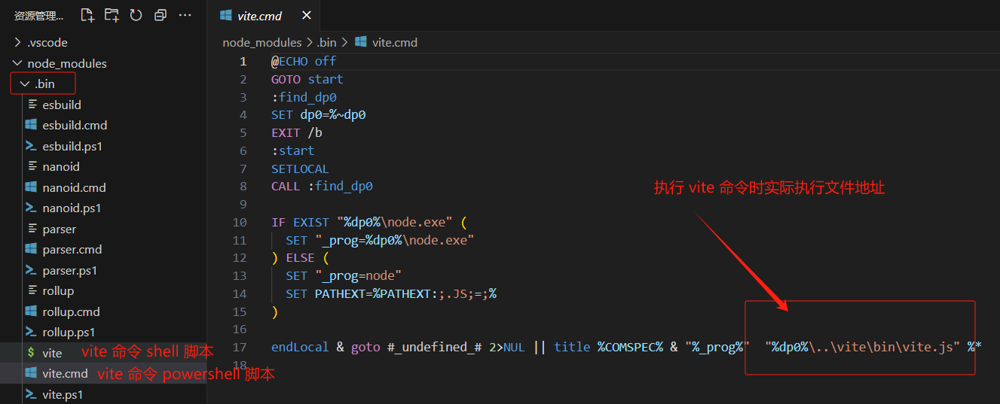

# **Vite原理解析**


## **命令解析**

在安装了 Vite 的项目中，可以在 npm scripts 中使用 `vite` 可执行文件，或者直接使用 `npx vite` 运行它。

下面是通过脚手架创建的 Vite 项目中默认的 npm scripts：

```js
{
  "scripts": {
    "dev": "vite", // 启动开发服务器，别名：`vite dev`，`vite serve`
    "build": "vite build", // 为生产环境构建产物
    "preview": "vite preview" // 本地预览生产构建产物
  }
}
```

可以指定额外的命令行选项，如 `--port` 或 `--open`。

在 windows 或 shell 中执行 `vite` 命令时，cmd 或 shell 会在当前目录下的 `./node_modules/.bin/` 目录下查找脚本;

以下是在 windows 下 powershell 中执行脚本：



在 Linux 下 shell 脚本为：


通过以上脚本，解析 `vite` 命令时，会在不同平台下加载对应 Shell 脚本， shell 中使用 node 执行 vite 脚本，vite 脚本位于 `./node_modules/vite/bin/vite.js` 目录下：


> vite 入口文件主要执行以下逻辑：
>
> 1. 解析命令参数；
> 2. 引入脚手架文件，调用 `start` 方法启动；

**总结：**

执行 `vite` 命令时:

1. 首先调用平台的 shell 脚本解析命令，使用 node 执行 vite 入口文件；
2. vite 入口文件首先解析命令参数，然后执行 `start ` 方法启动；


