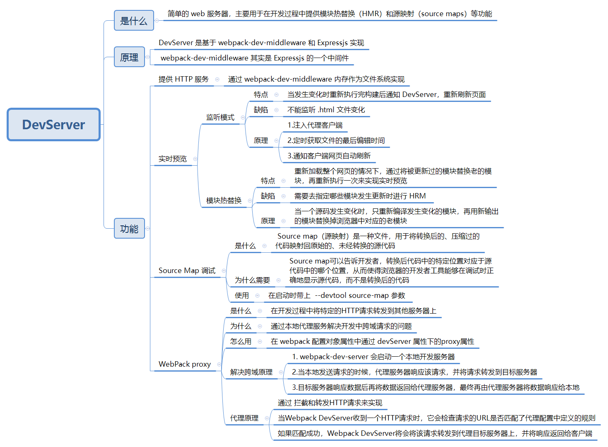
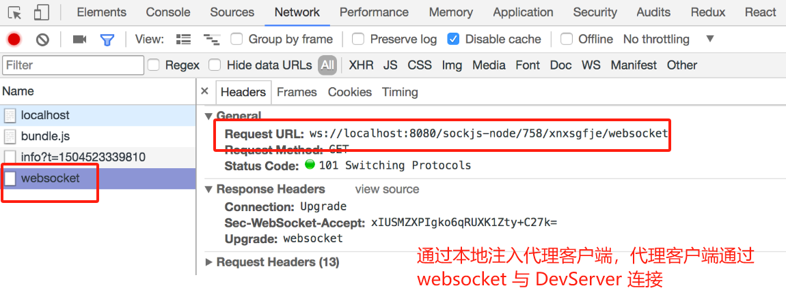
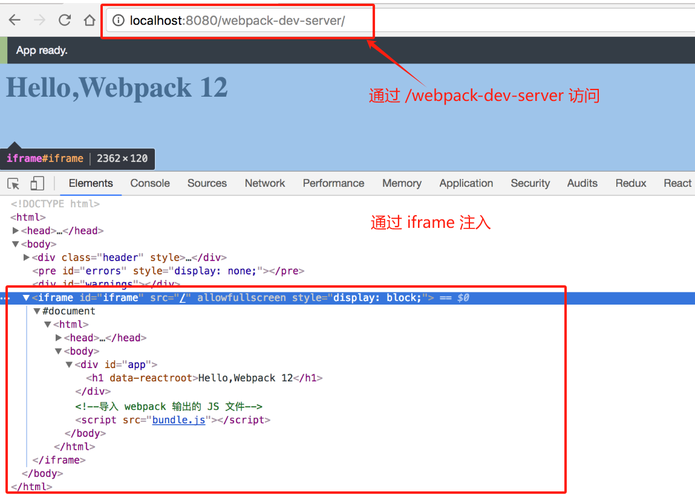
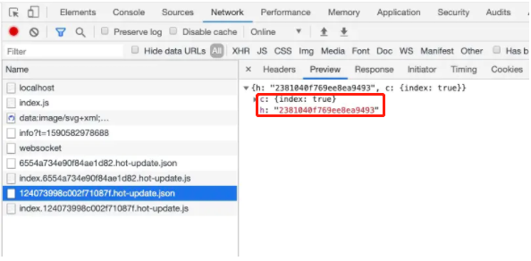
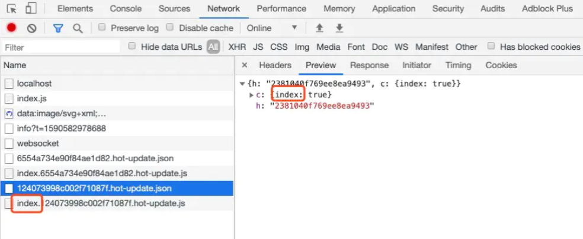

# DevServer




## **DevServer 是什么**

Webpack DevServer 是一个简单的 web 服务器，主要用于在开发过程中提供模块热替换（HMR）和源映射（source maps）等功能。

## DevServer 功能

1. 提供 HTTP 服务而不是使用本地文件预览；
2. 监听文件的变化并自动刷新网页，做到实时预览；
3. 支持 Source Map，以方便调试。
4. `webpack`代理服务，解决跨域问题。

Webpack DevServer 常见功能和配置选项:

| 功能               | 配置选项             | 解决的问题                                                 |
| :----------------- | :------------------- | :--------------------------------------------------------- |
| 静态文件服务       | `contentBase`        | 在开发环境中提供静态文件的本地服务器                       |
| 实时重载           | `hot`                | 当源代码发生变化时，自动刷新页面以显示最新的更改           |
| 热模块替换         | `hotOnly`            | 替换或插入模块的代码更新，而不刷新整个页面                 |
| 路由历史回退       | `historyApiFallback` | 用于单页应用程序，使得在路由切换时能够正确地回退到指定页面 |
| 代理               | `proxy`              | 将特定请求路径转发到其他服务器，解决跨域请求的问题         |
| 自动打开浏览器     | `open`               | 启动DevServer时自动打开默认浏览器                          |
| 自定义端口         | `port`               | 指定DevServer监听的端口号                                  |
| 自定义主机         | `host`               | 指定DevServer绑定的主机地址                                |
| HTTPS支持          | `https`              | 在DevServer上启用HTTPS协议                                 |
| 代理请求日志       | `proxy`              | 在控制台输出代理请求的详细日志信息                         |
| 压缩输出           | `compress`           | 压缩DevServer的输出，减小传输大小                          |
| 启用模块热替换日志 | `clientLogLevel`     | 控制台输出模块热替换相关的日志信息                         |
| 启用错误提示       | `overlay`            | 在页面上显示编译错误和警告信息                             |
| 自定义404页面      | `historyApiFallback` | 当请求的资源不存在时，显示自定义的404页面                  |

请注意，这里列出的只是一些常见功能和配置选项，Webpack DevServer还提供了其他更高级的功能和配置选项，如HTTP/2支持、自定义中间件、Webpack插件支持等。具体的功能和配置选项可以参考Webpack DevServer的官方文档。

## **使用** DevServer

1. 首先需要安装 DevServer：

```bash
npm i -D webpack-dev-server
```

2. 安装成功后执行 `webpack-dev-server` 命令， DevServer 就启动了，这时你会看到控制台有一串日志输出：

```shell
Project is running at http://localhost:8080/
webpack output is served from /
```

> DevServer 启动的 HTTP 服务器监听在 `http://localhost:8080/` 
>
> DevServer 启动后会一直驻留在后台保持运行，访问这个网址你就能获取项目根目录下的 `index.html`。
>
>  用浏览器打开这个地址你会发现页面空白错误原因是 `./dist/bundle.js` 加载404了。 同时你会发现并没有文件输出到 `dist` 目录，原因是 DevServer 会把 Webpack 构建出的文件保存在内存中，在要访问输出的文件时，必须通过 HTTP 服务访问。 由于 DevServer 不会理会 `webpack.config.js` 里配置的 `output.path` 属性，所以要获取 `bundle.js` 的正确 URL 是 `http://localhost:8080/bundle.js`，对应的 `index.html` 应该修改为：
>
> ```html
> <html>
> <head>
>   <meta charset="UTF-8">
> </head>
> <body>
> <div id="app"></div>
> <!--导入 DevServer 输出的 JavaScript 文件-->
> <script src="bundle.js"></script>
> </body>
> </html>
> ```


3. `webpack.config.js` 文件中配置 devServer:

   ```js
   module.exports = {
     // ...其他Webpack配置
   
     devServer: {
       contentBase: path.resolve(__dirname, 'dist'),//指定静态文件的根目录，这里设置为dist目录。
       hot: true,//启用模块热替换，实现实时更新。
       historyApiFallback: true,//启用路由历史回退，用于单页应用程序。
       proxy: {//配置代理规则，将以/api开头的请求转发到http://api.example.com。
         '/api': {
           target: 'http://api.example.com',
           pathRewrite: { '^/api': '' },
         },
       },
       open: true,//启动DevServer时自动打开默认浏览器。
       port: 8080,//指定DevServer监听的端口号为8080。
       host: 'localhost',//指定DevServer绑定的主机地址为localhost。
       https: false,//禁用HTTPS支持。
       compress: true,//启用输出压缩，减小传输大小。
       clientLogLevel: 'info',//设置模块热替换日志级别为info。
       overlay: true,//在页面上显示编译错误和警告信息。
     }
   };
   ```

   


## **DevServer 实时预览功能**

Webpack DevServe 实现实时预览有两种模式：

1.  **监听模式**：当发生变化时重新执行完构建后通知 DevServer，DevServer **重新刷新页面**，进行实时预览；
2.  **模块热替换**：在**不重新加载整个网页**的情况下，通过将被更新过的模块替换老的模块，再重新执行一次来实现实时预览。

### **监听模式**

> 文件监听是在发现源码文件发生变化时，自动重新构建出新的输出文件。

#### **开启监听模式**

要让 Webpack 开启监听模式，有两种方式：

- 在配置文件 `webpack.config.js` 中设置 `watch: true`。
- 在执行启动 Webpack 命令时，带上 `--watch` 参数，完整命令是 `webpack --watch`。

**命令行传入**

Webpack 默认是关闭监听模式的，在启动 Webpack 时通过 `webpack --watch` 来开启监听模式。

**文件配置**

相关的配置项如下：

```js
module.export = {
  // 只有在开启监听模式时，watchOptions 才有意义
  // 默认为 false，也就是不开启
  watch: true,
  // 监听模式运行时的参数
  // 在开启监听模式时，才有意义
  watchOptions: {
    // 不监听的文件或文件夹，支持正则匹配
    // 默认为空
    ignored: /node_modules/,
    // 监听到变化发生后会等300ms再去执行动作，防止文件更新太快导致重新编译频率太高
    // 默认为 300ms
    aggregateTimeout: 300,
    // 判断文件是否发生变化是通过不停的去询问系统指定文件有没有变化实现的
    // 默认每隔1000毫秒询问一次
    poll: 1000
  }
}
```


#### **监听模式缺陷**

**不能监听 `.html` 文件变化**

>  如果尝试修改 `index.html` 文件并保存，你会发现这并不会使 webpack 重新执行构建；
>
> 导致这个问题的原因是 Webpack 在启动时会以配置里的 `entry` 为入口去递归解析出 `entry` 所依赖的文件，只有 `entry` 本身和依赖的文件才会被 Webpack 添加到监听列表里。
>
>  而 `index.html` 文件是脱离了 JavaScript 模块化系统的，所以 Webpack 不知道它的存在。


#### **自动更新原理**

通过 DevServer 启动的 Webpack 会开启监听模式，当**发生变化时重新执行完构建后通知 DevServer**。

1. **注入代理客户端**：DevServer 会让 Webpack 在构建出的 JavaScript 代码里**注入一个代理客户端用于控制网页**，网页和 DevServer 之间通过 WebSocket 协议通信， 以方便 DevServer 主动向客户端发送命令。

2. **定时获取文件的最后编辑时间：**Webpack **定时的去获取文件的最后编辑时间**，每次都存下最新的最后编辑时间，如果发现当前获取的和最后一次保存的最后编辑时间不一致，就认为该文件发生了变化。
3. **通知客户端网页自动刷新：**DevServer 在收到来自 Webpack 的文件变化通知时通过注入的客户端控制网页刷新。


通过以上原理分析可以发现，主要涉及两个原理：

1. 获取文件变化原理：定时的去获取文件的最后编辑时间。
2. 自动刷新浏览器原理：监听到文件更新后的下一步是去刷新浏览器，webpack 模块负责监听文件，`webpack-dev-server` 模块则负责刷新浏览器。


#### **文件监听原理**

1. Webpack **定时的去获取文件的最后编辑时间**，每次都存下最新的最后编辑时间，如果发现当前获取的和最后一次保存的最后编辑时间不一致，就认为该文件发生了变化。
   * 配置项中的 `watchOptions.poll` 就是用于控制定时检查的周期，具体含义是每隔多少毫秒检查一次。

2. 当发现某个文件发生了变化时，并不会立刻告诉监听者，而是先缓存起来，收集一段时间的变化后，再一次性告诉监听者。
   * 配置项中的 `watchOptions.aggregateTimeout` 就是用于配置这个等待时间。这样做的目的是因为我们在编辑代码的过程中可能会高频的输入文字导致文件变化的事件高频的发生，如果每次都重新执行构建就会让构建卡死。

3. 对于多个文件来说，默认情况下 Webpack 会从配置的 Entry 文件出发，递归解析出 Entry 文件所依赖的文件，把这些依赖的文件都加入到监听列表中去。


#### **自动刷新浏览器原理**

监听到文件更新后的下一步是去刷新浏览器，webpack 模块负责监听文件，`webpack-dev-server` 模块则负责刷新浏览器。

 在使用 `webpack-dev-server` 模块去启动 webpack 模块时，webpack 模块的监听模式默认会被开启。   

webpack 模块会在文件发生变化时告诉 `webpack-dev-server` 模块。

控制浏览器刷新有三种方法：

1. 借助浏览器扩展去通过浏览器提供的接口刷新。
2. 往要开发的网页中注入代理客户端代码，通过代理客户端去刷新整个页面。
3. 把要开发的网页装进一个 iframe 中，通过刷新 iframe 去看到最新效果。

DevServer 支持第2、3种方法，第2种是 DevServer 默认采用的刷新方法。

通过 DevServer 启动构建后，在浏览器中打开网址 `http://localhost:8080/` 后， 在浏览器的开发者工具中你会发现由代理客户端向 DevServer 发起的 WebSocket 连接：



**配置浏览器自动刷新：**

配置项`devServer.inline`，它就是用来控制是否往 Chunk 中注入代理客户端的，**默认会注入**。


#### **优化文件监听性能**

由于保存文件的路径和最后编辑时间需要占用内存，定时检查周期检查需要占用 CPU 以及文件 I/O，所以最好减少需要监听的文件数量和降低检查频率。


**优化方案**

1. 忽略监听 `node_modules` 下的文件；
2. `watchOptions.aggregateTimeout` 值越大性能越好，因为这能降低重新构建的频率。
3. `watchOptions.poll` 值越大越好，因为这能降低检查的频率。


**忽略监听 `node_modules` 下的文件：**

>  开启监听模式时，默认情况下会监听配置的 Entry 文件和所有其递归依赖的文件。 
>
> 在这些文件中会有很多存在于 `node_modules` 下，因为如今的 Web 项目会依赖大量的第三方模块。
>
> 在大多数情况下我们都不可能去编辑 `node_modules` 下的文件，而是编辑自己建立的源码文件。

配置如下：

```js
module.export = {
  watchOptions: {
    // 不监听的 node_modules 目录下的文件
    ignored: /node_modules/,
  }
}
```


#### **优化自动刷新的性能**

**存在问题：**

在开启 inline 时，DevServer 会为每个输出的 Chunk 中注入代理客户端的代码，当你的项目需要输出的 Chunk 有很多个时，这会导致你的构建缓慢。 

其实要完成自动刷新，一个页面只需要一个代理客户端就行了，DevServer 之所以粗暴的为每个 Chunk 都注入，是因为它不知道某个网页依赖哪几个 Chunk，索性就全部都注入一个代理客户端。 网页只要依赖了其中任何一个 Chunk，代理客户端就被注入到网页中去。


**优化的思路：**

> 关闭 inline 模式，只注入一个代理客户端。

关闭 inline 模式：在启动 DevServer 时，可通过执行命令 `webpack-dev-server --inline false`（也可以在配置文件中设置）

在关闭了 inline 后，DevServer 会自动地提示你通过新网址 `http://localhost:8080/webpack-dev-server/` 去访问：



> **在关闭 inline 后，webpack 讲要开发的网页被放进了一个 iframe 中，编辑源码后，iframe 会被自动刷新**。


### **模块热替换**

> 模块热替换: 在**不重新加载整个网页的情况下，通过将被更新过的模块替换老的模块**，再重新执行一次来实现实时预览。


#### **开启模块热替换**

**命令行开启：**

模块热替换默认是关闭的，要开启模块热替换，你只需在启动 DevServer 时带上 `--hot` 参数，重启 DevServer 后再去更新文件，完整命令是 `webpack-dev-server --hot`。


**webpack 配置：**

```js
const webpack = require('webpack')
module.exports = {
  // ...
  devServer: {
    // 开启 HMR 特性
    hot: true
    // hotOnly: true
  }
}
```


**接入 Plugin：**

```js
const HotModuleReplacementPlugin = require('webpack/lib/HotModuleReplacementPlugin');

module.exports = {
  entry:{
    // 为每个入口都注入代理客户端
    main:['webpack-dev-server/client?http://localhost:8080/', 'webpack/hot/dev-server','./src/main.js'],
  },
  plugins: [
    // 该插件的作用就是实现模块热替换，实际上当启动时带上 `--hot` 参数，会注入该插件，生成 .hot-update.json 文件。
    new HotModuleReplacementPlugin(),
  ],
  devServer:{
    // 告诉 DevServer 要开启模块热替换模式
    hot: true,      
  }  
};
```

>  在启动 Webpack 时带上参数 `--hot` 其实就是自动为你完成以上配置


#### **模块热替换优势**

- 实时预览反应更快，等待时间更短。
- 不刷新浏览器能保留当前网页的运行状态，例如在使用 Redux 来管理数据的应用中搭配模块热替换能做到代码更新时 Redux 中的数据还保持不变。


#### **模块热替换缺陷**

> 需要去指定哪些模块发生更新时进行`HRM`

使用模块特替换时，修改并保存`css`文件，确实能够以不刷新的形式更新到页面中

但是，当我们修改并保存`js`文件之后，页面依旧自动刷新了，这里并没有触发热模块

所以，`HMR`并不像 `Webpack` 的其他特性一样可以开箱即用，需要去指定哪些模块发生更新时进行`HRM`，如下代码：

```js
if(module.hot){
    module.hot.accept('./util.js',()=>{
        console.log("util.js更新了")
    })
}
```


#### 模块热替换原理

> 当一个源码发生变化时，只重新编译发生变化的模块，再用新输出的模块替换掉浏览器中对应的老模块。

**模块热更新流程：**

1. `webpack-dev-server` 创建两个服务器：  提供静态资源的服务  (express)   和 `socket ` 服务;

2. `express server` 负责直接提供静态资源的服务  (打包后的资源直接被浏览器请求和解析)；

3. `socket server` 是一 个 `websocket `的长连接 ， 双方可以通信;

4. 当 `socket server` 监听到对应的模块发生变化时 ， 会生成两个文件 `json`  (manifest文件)  和 `.js`文件 ;

5. 通过长连接 `socket server` 可以直接将这两个文件主动发送给客户端  (浏览器);

6. 浏览器拿到两个新的文件后， 通过 `HMR runtime`机制，加载这两个文件，并且针对修改的模块进行更新。


* `Webpack compile`：将 JS 源代码编译成 bundle.js;
* `HMR Server`：用来将热更新的文件输出给 HMR Runtime;
* `Bundle server`：静态资源文件服务器 ， 提供文件访问路径;
* `HMR Runtime`：socket服务器 , 会被注入到浏览器,更新文件的变化;
* `bundle.js`：构建输出的文件;

在HMR Runtime 和 HMR Server之间建立 websocket,即图上4号线, 用于实时更新文件变化上面图中,  可以分成两个阶段：

* **启动阶段**:  为上图 `1 -> 2 -> A -> B` 

  * 在编写未经过`webpack`打包的源代码后，`Webpack Compile` 将源代码和 `HMR Runtime` 一起编译成 `bundle`文件，传输给`Bundle Server` 静态资源服务器

* **更新阶段**: 为上图 `1 -> 2 -> 3 -> 4` 

  * 当某一个文件或者模块发生变化时，`webpack`监听到文件变化对文件重新编译打包，编译生成唯一的`hash`值，这个`hash`值用来作为下一次热更新的标识

  * 根据变化的内容生成两个补丁文件：`manifest`（包含了 `hash` 和 `chundId`，用来说明变化的内容）和`chunk.js` 模块

  * 由于`socket`服务器在`HMR Runtime` 和 `HMR Server`之间建立 `websocket`链接，当文件发生改动的时候，服务端会向浏览器推送一条消息，消息包含文件改动后生成的`hash`值，如下图的`h`属性，作为下一次热更细的标识

    

  * 在浏览器接受到这条消息之前，浏览器已经在上一次`socket` 消息中已经记住了此时的`hash` 标识，这时候我们会创建一个 `ajax` 去服务端请求获取到变化内容的 `manifest` 文件

  * `mainfest`文件包含重新`build`生成的`hash`值，以及变化的模块，对应上图的`c`属性

  * 浏览器根据 `manifest` 文件获取模块变化的内容，从而触发`render`流程，实现局部模块更新

    


#### **优化模块热替换**

**存在问题：**

> 在发生模块热替换时,浏览器控制台只显示被替换模块的 id，不会告知详细的被替换的模块

在发生模块热替换时，你会在浏览器的控制台中看到类似这样的日志：


> 其中的 `Updated modules: 68` 是指 ID 为68的模块被替换了，这对开发者来说很不友好，因为开发者不知道 ID 和模块之间的对应关系，最好是把替换了的模块的名称输出出来

**优化方法：**

通过 Webpack 内置的 NamedModulesPlugin 插件，可以在控制台显示被替换的模块名称。

Webpack 配置文件接入该插件：

```js
const NamedModulesPlugin = require('webpack/lib/NamedModulesPlugin');

module.exports = {
  plugins: [
    // 显示出被替换模块的名称
    new NamedModulesPlugin(),
  ],
};
```

重启构建后你会发现浏览器中的日志显示了被替换模块的名称：


## Source Map

### **是什么？**

>  Source map（源映射）是一种文件，用于将转换后的、压缩过的代码映射回原始的、未经转换的源代码。它提供了一种对应转换后代码与源代码之间关系的方法，使开发者能够在调试过程中准确定位错误和异常。

### 为什么需要 **SourceMap？**

在开发过程中，通常会对代码进行转换、压缩和合并等操作，以提高代码执行效率和减小文件大小。然而，这样的转换会使得源代码与最终生成的代码之间的对应关系变得复杂，不易于调试和定位问题。

这时候，Source map就发挥了作用。

Source map包含了源代码与转换后代码的映射关系，通常以一种叫做VLQ（Variable Length Quantity，可变长度编码）的格式存储。

Source map可以告诉开发者，转换后代码中的特定位置对应于源代码中的哪个位置，从而使得浏览器的开发者工具能够在调试时正确地显示源代码，而不是转换后的代码。

#### **Source map 作用**

1. **调试**：使用Source map能够在开发者工具中准确地显示源代码，帮助开发者在调试过程中定位错误、断点和异常。
2. **错误报告**：当转换后的代码出现错误时，浏览器可以通过Source map将错误堆栈跟踪信息映射回源代码，从而提供更有用的错误报告。
3. **性能优化**：在生产环境中，通过使用Source map只在需要时启用调试功能，可以减小发布的代码包的大小，提高加载和执行性能。

### **怎么用？**

 Webpack 支持生成 Source Map，只需在启动时带上 `--devtool source-map` 参数。

加上参数重启 DevServer 后刷新页面，再打开 Chrome 浏览器的开发者工具，就可在 Sources 栏中看到可调试的源代码了。


## **WebPack proxy**

### **是什么？**

> Webpack的代理功能（proxy）允许你在开发过程中将特定的HTTP请求转发到其他服务器上。

### **为什么？**

> 通过本地代理服务解决**开发中**跨域请求的问题

代理功能允许你在开发过程中将请求代理到其他服务器上，以解决跨域请求的问题。

通过配置代理规则，Webpack DevServer可以将特定的请求路径映射到远程服务器上，从而绕过同源策略。

### **怎么用？**

在`webpack`配置对象属性中通过`devServer`属性提供，如下：

```js
// ./webpack.config.js
const path = require('path')

module.exports = {
    // ...
    devServer: {
        contentBase: path.join(__dirname, 'dist'),
        compress: true,
        port: 9000,
        // 配置本地代理
        proxy: {
            '/api': { // 代理匹配的路径
                target: 'https://test.com' // 转发的路径，通过将原路径中 /api 替换成 https://test.com
            }
        }
        // ...
    }
}
```

`devServetr`里面`proxy`则是关于代理的配置，该属性为对象的形式，对象中每一个属性就是一个代理的规则匹配：

* 属性的名称是需要被代理的请求路径前缀，一般为了辨别都会设置前缀为`/api`

* 值为对应的代理匹配规则，对应如下：

  - target：表示的是代理到的目标地址；

  - pathRewrite：默认情况下，我们的` /api-hy `也会被写入到URL中，如果希望删除，可以使用pathRewrite

  - secure：默认情况下不接收转发到 https 的服务器上，如果希望支持，可以设置为false；
  - changeOrigin：它表示是否更新代理后请求的 headers 中host地址


### **解决跨域原理**

* 在开发阶段， `webpack-dev-server` 会启动一个本地开发服务器，所以我们的应用在开发阶段是独立运行在 `localhost`的一个端口上，而后端服务又是运行在另外一个地址上；

* 所以在开发阶段中，由于浏览器同源策略的原因，当本地访问后端就会出现跨域请求的问题；

* 通过设置`webpack proxy`实现代理请求后，相当于浏览器与服务端中添加一个代理者；

* 当本地发送请求的时候，代理服务器响应该请求，并将请求转发到目标服务器，目标服务器响应数据后再将数据返回给代理服务器，最终再由代理服务器将数据响应给本地；
* 在代理服务器传递数据给本地浏览器的过程中，两者同源，并不存在跨域行为，这时候浏览器就能正常接收数据。


注意：**服务器与服务器之间请求数据并不会存在跨域行为，跨域行为是浏览器安全策略限制**


### **代理原理**

Webpack的代理功能（proxy）通过**拦截和转发HTTP请求来实现**：

1. 当Webpack DevServer收到一个HTTP请求时，它会检查请求的URL是否匹配了代理配置中定义的规则。
2. 如果匹配成功，Webpack DevServer将会将该请求转发到代理目标服务器上，并将响应返回给客户端。
   * 当一个请求到达Webpack DevServer时，它会检查请求的URL是否与代理配置中的源路径匹配。如果匹配成功，Webpack DevServer将会将该请求转发到配置的目标URL。
   * 在转发请求时，Webpack DevServer会将原始请求的URL进行修改，以便与目标服务器的路径匹配（如果配置了路径重写）。

代理配置规则通常包括以下信息：

1. **源路径（context）**：指定需要被代理的请求路径的前缀或模式。例如，`/api`或`/api/**`。
2. **目标URL（target）**：指定将请求转发到的目标服务器的URL。例如，`http://api.example.com`。
3. **路径重写（pathRewrite）**：可选项，用于对请求路径进行修改。可以用于移除前缀、重定向到其他路径等操作。

webpack 中提供服务器的工具为 `webpack-dev-server`，`webpack-dev-server`是 `webpack` 官方推出的一款开发工具，将自动编译和自动刷新浏览器等一系列对开发友好的功能全部集成在了一起。

 `webpack-dev-server`目的是为了提高开发者日常的开发效率，**只适用在开发阶段**

`proxy`工作原理实质上是利用`http-proxy-middleware` 这个`http`代理中间件，实现请求转发给其他服务器：

> 在开发阶段，本地地址为`http://localhost:3000`，该浏览器发送一个前缀带有`/api`标识的请求到服务端获取数据，但响应这个请求的服务器只是将请求转发到另一台服务器中
>
> ```js
> const express = require('express');
> const proxy = require('http-proxy-middleware');
> 
> const app = express();
> 
> app.use('/api', proxy({target: 'http://www.example.org', changeOrigin: true}));
> app.listen(3000);
> 
> // http://localhost:3000/api/foo/bar -> http://www.example.org/api/foo/bar
> ```
