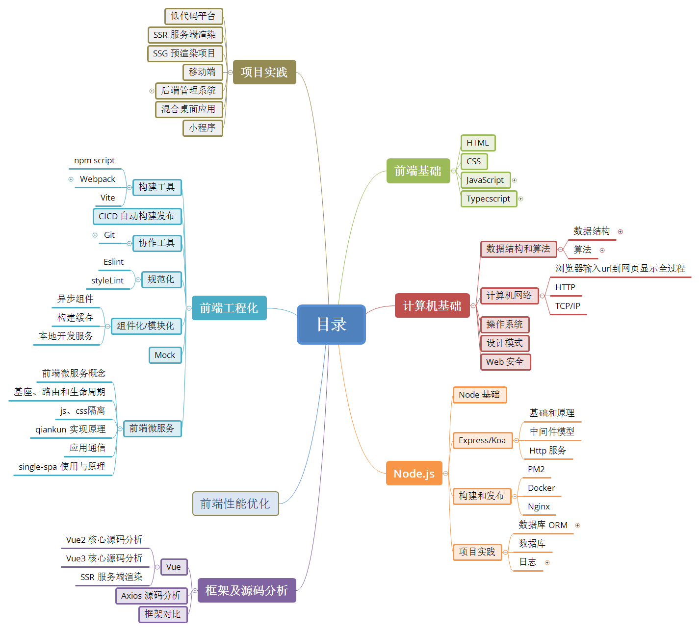

## 目标

### **前端高级/专家标准**

| 方向 | 标准                                                         |
| ---- | ------------------------------------------------------------ |
| 基础 | 基础知识扎实（能解释是什么，为什么，怎么样）                 |
| 深度 | 基础知识扎实(深入理解基础语言原理)、理解框架/库原理、手写基础原理 |
| 广度 | 项目广度（实践过的项目类型多）、项目深度（能解释项目是什么、为什么、怎么做） |
|      | 前端工程化                                                   |
|      | 组件化/模块化                                                |
|      | DevOps                                                       |
|      | 性能优化                                                     |
|      | 多端/混合开发                                                |
|      | SSR/SSG                                                      |
|      | 可视化                                                       |
|      | 微前端                                                       |

## **复习大纲**

围绕博客中知识专题进行复习补充，以算法和大厂面试真题为主进行查漏补缺

复习方式：三轮复习法。以大厂面试题为质量考核目标。

* 第一轮：**以算法和刷题为主，刷题后归纳总结题型**，**并总结博客笔记缺少的技术栈**；
* 第二轮：刷面试真题，总结面试题，根据面试题补充知识点；复习博客笔记；
* 第三轮：重点知识点背诵；

## **八股文基础**

**八股文基础**复习：面试真题 + 面经 + 博客总结；

### **复习大纲**

>  刷面试真题 + 面经 + 总结博客题目和难点

### 真题复习进度

| 方向           | 内容                                                         | 进度                         |
| -------------- | ------------------------------------------------------------ | ---------------------------- |
| Node.js        | 《Node.js面试真题-71页》《[Node中文教程](https://dev.nodejs.cn/learn/)》 | 完成《Node.js面试真题-71页》 |
| Javascript/ES6 |                                                              |                              |
| Typescript     | [《W3Cschool-Typescript》](https://www.w3cschool.cn/typescript/typescript-interfaces.html) | 《接口》                     |
| HTML           |                                                              |                              |
| CSS            |                                                              |                              |
| HTTP           |                                                              |                              |
|                |                                                              |                              |
| Vue2           |                                                              |                              |
| Vue3.0         | 《[Vue3 文档](https://cn.vuejs.org/guide/introduction.html)》、《Vue3 面试真题》 |                              |
|                | [Vue3 源码]([Vue 3.0 核心源码解析_哔哩哔哩_bilibili](https://www.bilibili.com/video/BV15e411z7YJ/?spm_id_from=333.999.0.0)) |                              |
|                | Vite                                                         |                              |
|                |                                                              |                              |
| React          |                                                              |                              |
|                |                                                              |                              |
| Webpack        | 《[webpack5 学习笔记](https://www.yuque.com/u2011448/kgnd7d/xzgf05?singleDoc)》、《[深入浅出 webpack](https://webpack.wuhaolin.cn/)》 |                              |
| 设计模式       |                                                              |                              |
| Git            |                                                              |                              |
| Linux          |                                                              |                              |

----

## **数据结构和算法**

* **数据结构和算法**复习：基础知识 + Leetcode + 博客总结；

### **复习大纲方案**

* 复习大纲：	
  * [算法通关手册](https://algo.itcharge.cn/)
  * [算法博客](https://www.conardli.top/)
  * [《牛客网：面试高频 Top 202》](https://www.nowcoder.com/exam/oj?page=1&tab=%E7%AE%97%E6%B3%95%E7%AF%87&topicId=354)
  * [《牛客网：华为机试》](https://www.nowcoder.com/exam/oj/ta?page=1&pageSize=50&search=&tpId=37&type=37)

* 复习方案：
  * 以算法博客和牛客网大纲分类刷题，总结各类题型特征和解题方法；
  * 定期回顾各类题型解题方法，加强记忆；
  * 集中刷华为机试题，并归纳总结方法，完善博客笔记；

### 复习计进度

| 科目             | 目录     | 复习内容                                                     | 当前进度             | 状态 |
| ---------------- | -------- | ------------------------------------------------------------ | -------------------- | ---- |
|                  | 双指针   | [《牛客网：双指针》](https://www.nowcoder.com/exam/oj?page=1&tab=%E7%AE%97%E6%B3%95%E7%AF%87&topicId=354)、[算法博客](https://www.conardli.top/) | 完成一轮博客总结复习 |      |
|                  | 链表     | [《牛客网：链表》](https://www.nowcoder.com/exam/oj?page=1&tab=%E7%AE%97%E6%B3%95%E7%AF%87&topicId=354)、[算法博客](https://www.conardli.top/)、[数据结构](http://data.biancheng.net/intro/) | 完成一轮博客总结复习 |      |
| 牛客：数据结构   | 栈和队列 | [《牛客网：栈&队列》](https://www.nowcoder.com/exam/oj?page=1&tab=%E7%AE%97%E6%B3%95%E7%AF%87&topicId=354)、[算法博客](https://www.conardli.top/)、[数据结构](http://data.biancheng.net/intro/) | 完成一轮博客总结复习 |      |
|                  | 数组     | [《牛客网：数组》](https://www.nowcoder.com/exam/oj?page=1&tab=%E7%AE%97%E6%B3%95%E7%AF%87&topicId=354)、[算法博客](https://www.conardli.top/)、[数据结构](http://data.biancheng.net/intro/) | 完成一轮博客总结复习 |      |
|                  |          |                                                              |                      |      |
|                  | 字符串   | [《牛客网：字符串》](https://www.nowcoder.com/exam/oj?page=1&tab=%E7%AE%97%E6%B3%95%E7%AF%87&topicId=354)、[算法博客](https://www.conardli.top/)、[数据结构](http://data.biancheng.net/intro/) | 完成一轮博客总结复习 |      |
|                  | 二叉树   | [《牛客网：二叉树》](https://www.nowcoder.com/exam/oj?page=1&tab=%E7%AE%97%E6%B3%95%E7%AF%87&topicId=354)、[算法博客](https://www.conardli.top/)、[数据结构](http://data.biancheng.net/intro/) | 完成一轮完成博客总结 |      |
|                  | 位运算   | [《牛客网：位运算》](https://www.nowcoder.com/exam/oj?page=1&tab=%E7%AE%97%E6%B3%95%E7%AF%87&topicId=354)、[算法博客](https://www.conardli.top/)、[数据结构](http://data.biancheng.net/intro/) |                      |      |
|                  | 堆       |                                                              | 完成堆基础知识总结   |      |
|                  | 图       |                                                              | 完成图基础知识总结   |      |
|                  | 哈希表   | [《牛客网：哈希》](https://www.nowcoder.com/exam/oj?page=1&tab=%E7%AE%97%E6%B3%95%E7%AF%87&topicId=354)、[算法博客](https://www.conardli.top/) |                      |      |
|                  |          |                                                              |                      |      |
| 牛客：算法       | 排序     | [《牛客网：排序》](https://www.nowcoder.com/exam/oj?page=1&tab=%E7%AE%97%E6%B3%95%E7%AF%87&topicId=354)、[算法博客](https://www.conardli.top/)、[数据结构](http://data.biancheng.net/intro/) |                      |      |
|                  | 递归     |                                                              |                      |      |
|                  | 分治     | [《牛客网：二分&分治》](https://www.nowcoder.com/exam/oj?page=1&tab=%E7%AE%97%E6%B3%95%E7%AF%87&topicId=354)、[算法博客](https://www.conardli.top/) |                      |      |
|                  | 回溯     | [《牛客网：递归&回溯》](https://www.nowcoder.com/exam/oj?page=1&tab=%E7%AE%97%E6%B3%95%E7%AF%87&topicId=354)、[算法博客](https://www.conardli.top/) |                      |      |
|                  | 动态规划 | [《牛客网：动态规划》](https://www.nowcoder.com/exam/oj?page=1&tab=%E7%AE%97%E6%B3%95%E7%AF%87&topicId=354)、[算法博客](https://www.conardli.top/) |                      |      |
|                  | 贪心     | [《牛客网：贪心》](https://www.nowcoder.com/exam/oj?page=1&tab=%E7%AE%97%E6%B3%95%E7%AF%87&topicId=354)、[算法博客](https://www.conardli.top/) |                      |      |
|                  |          |                                                              |                      |      |
| 牛客：华为机试题 |          |                                                              |                      |      |
|                  |          |                                                              |                      |      |

----

## **项目总结**

* **项目总结**： 多挖掘项目中的难点和重点，挖掘项目底层知识点，扩展并总结项目，以低代码项目为重点，挖掘项目重点难点；

### **复习大纲**

项目准备：在日常工作中多总结，并将总结笔记归纳到笔记中；

* `项目动机`：需求、为什么做、项目对公司来说有什么意义；

* `负责角色`：在项目中负责的什么角色，是`Owner`、`核心开发`

* `技术选型`：这个项目的选型设计（`如果有技术选型的话`）

* `架构设计`：架构设计和分层设计，如果你有`参与或者是独自架构`的，可以选择在简历上直接附图（`画成横向的`）

* `细节实现`：一些具体的细节点如何实现，`比如监控SDK就有各个监控数据的细节采集方式`；

* `亮点设计`：做这个项目中的一些难点考虑，亮点设计等；

* `项目成果`：表明你这个项目达成了什么成果，`最好有数据说话`；

**准备项目需要做到这个方面的总结**：`为什么做`、`怎么做`、`有什么难点&问题`、`业界怎么做更好`；

项目总结：

* 项目难点和难点攻克过程总结、难点原理总结
* 多挖掘项目中难点：架构设计方案、复杂需求设计方案、性能优化等

### 项目总结进度

| 项目          | 总结内容                                                     | 进度                      |
| ------------- | ------------------------------------------------------------ | ------------------------- |
| 低代码        |                                                              |                           |
|               | 项目介绍、功能和项目重点难点介绍                             | 0%                        |
|               | 总结服务端自动化部署方案                                     | 100%                      |
|               | 总结前端自动化部署方案并自动化部署方案对比                   | 50%（部署对比方案未总结） |
|               | 总结从零到部署整个站点流程(前端、服务端、服务器、域名等流程) | 0%                        |
|               | 总结项目架构、低代码原理                                     | 0%                        |
|               | Node 项目结构和重点难点                                      | 0%                        |
|               | MySQL 数据库                                                 | 0%                        |
|               | Squelize                                                     | 0%                        |
|               | 项目难点：拖拽实现                                           | 0%                        |
|               |                                                              |                           |
| PMP           |                                                              |                           |
|               | 项目背景、功能和项目重点难点介绍                             | 0%                        |
|               | 自动构建和部署                                               | 100%                      |
|               | 总结一次性能优化过程、性能优化方案、优化结果                 | 10%                       |
|               | 总结组件封装技巧和实践（DSL）                                | 100%                      |
|               |                                                              |                           |
|               |                                                              |                           |
| SRDPM         | 项目背景、功能和项目重点难点介绍                             | 0%                        |
|               | 团队协作流程和方式                                           | 0%                        |
|               | Git分支管理、前端规划                                        | 100%                      |
|               | 开发流程                                                     | 100%                      |
|               | 总结组件封装技巧和Element-UI 组件二次封装实践                | 50%：(配置化组件未总结)   |
|               | 组件封装技巧（基础知识，技巧和实践经验）                     | 0%                        |
|               | 权限管理                                                     | 100%                      |
|               | OnlyOffice 文档在线编辑和协同编辑                            | 0%                        |
|               | 流程管理                                                     | 0%                        |
|               | 自动构建和部署                                               | 100%                      |
|               | 流程引擎                                                     | 0%                        |
|               | 移动端适配方案（PC与移动端公用）                             | 0%                        |
|               | 单点登录流程以及前后端实现                                   |                           |
|               |                                                              |                           |
| wepcar        | SSG 项目搭建流程（webpack）和项目特点                        |                           |
|               | 移动端开发技巧                                               |                           |
|               | 移动端屏幕适配方案                                           |                           |
|               | 打点上报系统                                                 |                           |
|               | Google/FaceBook  登录接入                                    |                           |
|               | 多国主题管理开发                                             |                           |
|               | PC SSR 项目搭建流程和项目特点                                |                           |
|               | LightHouse 使用和实践，经销商模块性能优化过程，总结性能优化  |                           |
|               | 总结打点上报系统和流程，webcar 打点系统实现                  |                           |
|               |                                                              |                           |
| 唤镜 引擎 Hub | QtWebEngine 总结                                             |                           |
|               | hub 登录                                                     |                           |
|               | 异步下载（JS调用 c++）                                       |                           |

## **源码分析**

| 目录         | 内容                                                         | 进度 |
| ------------ | ------------------------------------------------------------ | ---- |
| Vue3源码分析 | [Vue 3.0 核心源码解析_哔哩哔哩_bilibili](https://www.bilibili.com/video/BV15e411z7YJ/?spm_id_from=333.999.0.0&vd_source=0c5c6ac7ddc21ccc8901d97d01bad522) | 0%   |
|              |                                                              |      |
|              |                                                              |      |

## **高级/专家方向**

### **学习大纲方向**

1. 前端架构
2. 前端工程化 / devops
3. 组件化/模块化
4. 性能优化
5. 低代码/可视化
6. 前端微服务/BFF
7. 全栈 Node.js

### **前端架构**

### 前端工程化 / devops

### **组件化/模块化**

### **性能优化**

| 目录 | 内容 | 进度 |
| ---- | ---- | ---- |
|      |      |      |
|      |      |      |
|      |      |      |

### **低代码/可视化**

| 目录   | 内容                    | 进度 |
| ------ | ----------------------- | ---- |
| 低代码 | 《印客学院-低代码项目》 | 0%   |
|        |                         |      |
|        |                         |      |

### **前端微服务/BFF**

### **全栈 Node.js**

----

## 复习时间表

| 时间                        | 复习内容           |
| --------------------------- | ------------------ |
| **周一至周五: 8.30~10.10**  | **数据结构和算法** |
| **周一至周五: 18.30~20.10** | **前端基础/项目**  |
|                             |                    |

----

### 复盘时间统计

| 复盘时间 | 复盘内容 | 复盘结论 |
| -------- | -------- | -------- |
|          |          |          |

****

